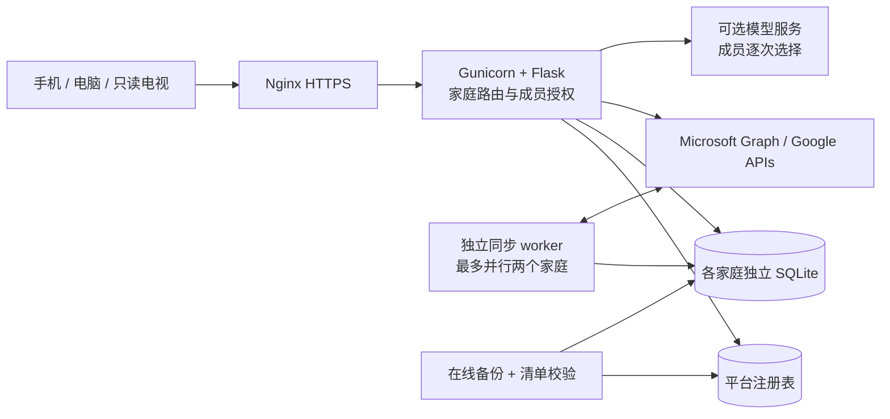

# 家庭中枢 · Family Dashboard

> **线上版本：2026-09-16 13:24:33（北京时间），镜像 `sha256:ea399441e6696bc29214842ab8c47e3db943714c1ae72a05ca1266bdc4a1b739`。** 完整账本分页、搜索和导入金额校验已通过 SOURCE 43→43 更新发布；258 源文件、43 Markdown、44 静态资源、107 方法／路径模板、43 张户内表及 2 张平台表。实际安装为同树 main `79faaf3`／integration `82f4401`；本次发布后的七份文档及文档检查器修订仅在本地交接，尚未同步服务器。 详见 [HANDOFF](docs/HANDOFF.md) 与 [VALIDATION](docs/VALIDATION.md)。

面向两位家庭成员的日程、待办、采购、旅行、财务与助理工作台。手机和电脑负责维护，50／75 英寸电视负责常亮展示；两个住处的屏幕可各自设置侧重、布局和主题。目前支持邀请建立独立家庭，每户两位成员。

本 README 汇总**软件方案、已开发功能、代码地图、接口入口、开发环境、部署指导与联合开发方式**。字段级接口、完整安装命令、用户操作和验收记录分别放在 `docs/`，通过下方导航进入。

| 你要做什么 | 从这里开始 |
|---|---|
| 了解产品及全部已开发部分 | 本文「已开发范围与边界」「软件架构」「代码地图」 |
| 开发一个模块 | [项目规则](AGENTS.md) → [交接与候选状态](docs/HANDOFF.md) → [Git 分支协作](docs/GIT-WORKFLOW.md) → 对应接口文档 |
| 对接或修改 API | [基础 API](docs/API.md)、[平台 API](docs/PLATFORM-API.md)、[财务 API](docs/FINANCE-API.md)、[完整路由索引](docs/PLATFORM-ROUTES.md) |
| 安装、更新、备份或排障 | [部署指导](docs/DEPLOYMENT.md)、[运维手册](docs/OPERATIONS.md)、[恢复演练](docs/RECOVERY-REHEARSAL.md) |
| 把项目交给其他 agent | 源码 ZIP 供阅读；Git bundle 保留 main、候选分支和完整提交历史。恢复命令见 [Git 指导](docs/GIT-WORKFLOW.md) |

## 本次更新：完整账本与金额校验

进入「财务 → 账单与订单」，选择月份后可搜索标题、交易编号和商品明细、翻页查看全部本人记录。同月超过 500 条的记录也能继续核对；修改、删除或采购核对后保留查询和合理页码。月度预算和汇总始终使用完整账本；翻页期间发生变化时提示刷新，避免混用不同结果。

文件导入接受完整的 `1,234.56`、`¥ 1,234.56`，拒绝 `1,23` 等有歧义的金额格式并标出行错误；不会猜测或修订历史记录，手工金额接口保持原约定。接口见 [财务 API](docs/FINANCE-API.md)，格式见 [导入契约](docs/FINANCE-IMPORT.md)。

后端、界面、工具策略与文档各自在独立分支／worktree 提交，由非作者审查后合入 integration；组合验证和再次审查后合入 main，再独立完成镜像、双户演练及生产发布。Windows／Linux 各 435 项受影响后端、新镜像 275 项发布工具、7 组 215 项浏览器分别记录，不能相加为一次全套测试。数据结构、依赖和账户配置保持。

## 历史发布：11:39 的订单与待办增量

已审 integration `ecc3edc` 合入 main `54c0854` 后，以同一文件树完成构建、隔离验证及实际发布。此次更新包括以下功能；开发、审查、合并和上线分别记录在 [HANDOFF](docs/HANDOFF.md) 和 [VALIDATION](docs/VALIDATION.md)。

- **待办起步：** 从空清单添加首项本地待办，或设置常用清单后返回；云端发布仍需选择、预览和确认。
- **淘宝订单：** 已验证的 XLSX 格式按明确合并范围识别订单，保留各项商品名称、规格、数量、标价和地址原文；订单实付只计算一次。缺失或冲突的结构仍拒绝，不补猜日期、金额、币种或退款。
- **重复导入：** 订单状态或内容变化会提示冲突并保留原记录；不会静默覆盖以前的核对结果。
- **商品明细界面：** 在预览、本人账本与核对页展开查看；数量和标价不参与额外合计，商品地址仅作为文本。接口见 [财务 API](docs/FINANCE-API.md)，支持范围见 [导入契约](docs/FINANCE-IMPORT.md)。

真实原文件仅完成本地临时预览，没有确认写入私人账本。本次按 [43→43 源码发布流程](docs/SOURCE-RELEASE.md) 更新两项既有 Python 与五项静态文件，没有 schema、依赖或配置变化。Windows 受影响后端 406 项、新镜像 Linux 后端 406 项与工具 269 项分别通过；浏览器 187 项补测功能与 65 项适用历史结果分列，共 252 项，另有 59 项路由，不是一次全套重跑。双户隔离演练与实际单户生产的备份、数据保持和读回分别记录。不能用 static-only 入口承接 Python 修改，也不能重放旧的 42→43 迁移。

## 版本与交接状态

当前生产版本于 **2026-09-16 13:24:33（北京时间）** 发布，镜像 `sha256:ea399441e6696bc29214842ab8c47e3db943714c1ae72a05ca1266bdc4a1b739`，固定继承 `f82bc0fc…` 父镜像并追加一层完整 Python/static。requirements、Dockerfile、Compose、Nginx、原 `.env` 与完整解析配置保持，没有 schema 初始化或数据库恢复。

| 项目 | 已核验结果 |
|---|---|
| 技术栈 | Flask／原生 JavaScript／SQLite；Docker Compose 运行 app、sync、web |
| 发布源码 | 258 文件、43 Markdown，manifest `7089ca8899929ec8eee8b705547943c697b21c684014855f92b7f5ca4fa8fb42`；发布后七份文档及文档检查器修订仅在本地 |
| Git 基线 | 已安装 integration `82f4401` → main `79faaf3`，同树 `e627bb8…`；各任务独立分支/worktree，无托管平台强制保护 |
| 接口与存储 | 107 个 Flask 方法／路径模板，另有 WSGI 家庭入口；43 户内表（41 业务 + 2 认证）、平台 2 表 |
| 受影响后端 | Windows 435 passed；新镜像 Linux 同一组 435 passed；各 0 skipped / failed / error |
| 新部署工具 | 新镜像 Linux 275 passed；先前专项 88 项按依赖适用性另列，不重复计数 |
| 受影响浏览器 | 7 组 215 项；真实临时 Flask/SQLite/Edge、虚构输入、0 页面错误与外站请求，非一次全套测试 |
| 实际 SOURCE 演练 | 两户合成 Docker：每户 43 表、平台 2 表、旧认证、8 份资料和 3 库备份保持；不执行恢复，受管资源清理通过，保护镜像而保留一个标签 |
| 生产数据与配置 | 实际 1 户 43 表 + 2 平台表、2 库完整组备份；安装前、启动后和 HTTP 后三次完整比较通过，原 `.env` 与完整解析配置保持 |
| 内部读回 | 44 静态 SHA 和 8 匿名权限 GET 通过；app/sync/web 正常且 app 健康；发布后独立核对全部 258 源文件、manifest、原配置和镜像 |
| 仍待真实验收 | 新云日历／待办写入、银行或电商自动连接、可选模型、用户端公网浏览器与实体设备、生产覆盖恢复和商业化运营 |

服务器另经正常 TLS 验证完成五个匿名 HTTPS 读回：healthz 200、新账本 API 401，以及三项更新的静态资源 200 且 SHA 匹配。这仅是服务器 HTTPS 客户端验证，不代表手机或实体电视验收。数据相等结论覆盖停写至 HTTP 核对窗口，恢复 sync/web 后允许正常业务变化。

### 旅行资料

从旅行或具体航班、住宿、活动进入资料夹，上传 PDF/JPG/PNG/WebP。默认仅上传者可见，明确共享后本户另一成员可读；电视不能读取。上传者可改标题、关联旅行或分段、逐份下载和删除。删除旅行后资料保留在“我的旅行资料”，可重新关联；文件不进入云日历、待办或助理。五个接口、大小限制、幂等及恢复边界见 [资料契约](docs/JOURNEY-DOCUMENTS.md)。

旅行详情展示已保存的航班号、起降、住宿地址、活动地点与备注，可复制并从日程定位原分段。已保存文件不代表预订平台或文件安全扫描验收。个人数据 ZIP 只含允许的资料元数据，批量文件迁移仍未实现；单份文件在资料夹明确下载。

| 入口 | 地址或文档 |
|---|---|
| 日常管理 | [家庭中枢](https://home.caesarcharles.world/) |
| 电视展示 | [电视配对与只读看板](https://home.caesarcharles.world/tv) |
| 虚构数据演示 | [普通演示](https://home.caesarcharles.world/demo)／[电视演示](https://home.caesarcharles.world/demo?tv=1) |
| 账号接入 | [Microsoft／Google 配置指导](docs/ACCOUNT-SYNC.md) |
| 新 agent 阅读顺序 | 本 README → [HANDOFF](docs/HANDOFF.md) → 所负责模块契约 → [DEVELOPMENT](docs/DEVELOPMENT.md) |
| 部署人员阅读顺序 | [DEPLOYMENT](docs/DEPLOYMENT.md) → [OPERATIONS](docs/OPERATIONS.md) → [VALIDATION](docs/VALIDATION.md) |

交接历史：16:25 为 218 文件／35 文档，20:23 旅行资料为 237／40，22:32 静态发布为 248／42，11:39 SOURCE 发布为 255／43，本次为 258／43。各次原件和迁移边界分别保留。

## 此前旅行与资料能力

此前已发布的首页快速记录、旅行卡和旅行页新建入口继续统一进入“填写 → 预览准备／采购／日程 → 确认”的旅行向导；已有草稿保留，旧旅行仍能编辑。确认前不保存，也不自动订票、付款或写入云端。使用与公共接口见 [新建旅行入口](docs/TRAVEL-ENTRY.md)。

该历史静态发布只改变三个前端文件，原演练失败、生产预检拒绝与受控重试继续保留在 [验收记录](docs/VALIDATION.md)；不与本次 SOURCE 验证混算。

旅行资料、完整细项、旅行执行、订单兼容、消费观察及其他模块继续保留。真实消费观察文件仍未自动上传或确认，见 [消费观察契约](docs/SPENDING-OBSERVATIONS.md)。

## 已开发范围与边界

下表描述当前已发布实现；真实账号、数据覆盖和实体设备的未验收范围单独列出。

| 模块 | 已实现 | 当前边界 |
|---|---|---|
| 工作台 | 桌面侧栏、手机底导航、今日/日程/待办/采购/旅行/财务/助理/连接/设置入口，页面搜索、刷新与前后导航 | 搜索不包含私有财务；电视保持独立布局 |
| 主题与偏好 | 三主题、两种密度、日程默认视图；成员首页和每台电视各自支持卡片排序／隐藏／恢复默认，revision 冲突处理 | 按按钮/键盘排序，尚无拖动或自定义背景；隐藏卡片不改变 API 可见范围 |
| 家庭与身份 | 邀请创建独立家庭、成员密码登录、资料维护、Microsoft / Google 绑定身份登录、显式切换家庭 | 默认最多 30 户、每户两人；无公开匿名注册、收费或更多成员角色 |
| 登录设备 | 查看本人有效浏览器登录；确认退出指定或其他全部会话；当前浏览器可从设置退出 | 最近使用约每 5 分钟更新；名称仅概括浏览器和系统，不证明物理设备或实时在线；云账号绑定与 TV 配对保持 |
| 日程 | 今日、本周、前后 3 天、翻页、完整标题/地点、每日数量与时段并集；本地安排及两个云平台读取 | 自动轮询；仅统计选择的来源；纯 iCloud 实时连接未完成 |
| 家庭例行计划 | 每日／每周／每月共享模板、三期预览、完成推进、暂停／恢复／跳过／归档、历史和助理入口 | 上海日期、固定月末 clamp；当前事项独立；新期不复制采购实付／照片／旅行或云来源，不自动发布到云 |
| 待办 | 本地任务与云清单新建/完成回写；旅行/助理/已有任务可确认发布到 Microsoft To Do 或 Google Tasks 主清单，保留原 ID/负责人并回流完成状态 | 新发布队列尚未完成真实云写验收；轮询同步；不确定创建结果需查远端，不盲目重建 |
| 采购与图片 | 数量、负责人、备注、预计总价、实付、勾选、最多 3 张参考图片；压缩与认证读取 | 未知金额与零区分；HEIC 需转换；不自动扣减公共资金 |
| 采购实付核对 | 本人账单或已核对订单选择有效 CNY 付款；搜索分页、整项实付和独立完成状态、预览确认、读回、更新、来源变化提示与两种解除；精确进入原对账后可返回 | 私有来源不公开，只共享 actual/done；不修改账本、预算、公共余额或旅行 paid，不自动响应退款，不执行付款或转账 |
| 旅行联动 | 自然语言简报经三步补齐后进入原可编辑向导；v1/v2 虚构 JSON 模板下载、格式说明、文件/粘贴导入后审阅确认；多国家/城市、航班起降当地时间、住宿入住/退房、活动、预订状态；预览后生成准备任务、采购和日程；详情自动刷新进度、按负责人筛选并处理原发布；迁期保留固定事项、三方比较保护独立编辑 | 预订状态由用户标记，未连接航司/酒店订单；日期/时区语义变更须再次核对云发布；旧日期级计划兼容 |
| 旅行资料 | 本人资料库、旅行／分段关联、私有或明确共享、上传重放、修改、逐份下载和删除 | 文件只由用户上传；PDF 不内嵌、不抓 URL；不声称病毒扫描或预订核验；TV 不可读 |
| 云日历发布 | 独立写权限升级、目标日历选择、确认入队、创建/更新读回、迁期、重试、暂停、远端修改冲突核对；时间语义复核与同目标重连恢复 | 新写流程仅完成本地模拟服务商验收；需本人真实授权验证；不自动邀请与会者或删除远端事件 |
| 公共财务 | 荷包余额、日常预算、旅行准备金、储蓄、出资比例、核对日期；经批准的资产/负债汇总 | 手动快照；支付宝小荷包与银行没有自动连接；不执行转账或理财交易 |
| 私有财务 | 完整本人账本分页和标题／编号／商品搜索；CSV/XLSX 工作表与金额列选择；账单/订单预览、确认与对账；确认后定位实际月份，成功后读回失败只重试 GET；完整来源基线和独立消费观察分别预览确认，原资产/负债小计保持批准的共享范围 | 真实文件变体和私人来源映射未全部验证；观察报告不是已核对实付，不与账本相加；未启用无人值守刷新或银行连接 |
| 投资 | 已发布手工录入和分币种盈亏；已发布 CSV/XLSX 整理表预览、原记录更新、手工记录明确关联、导出与回执 | 没有券商连接、实时行情或自动汇率；缺估值不按零处理，股息费用不含在当前盈亏中 |
| 助理 | 旅行文字简报、无模型三步表单、重新整理／继续保留与原旅行确认；本地近期概览、搜索、待办/采购草案与逐项确认；已发布“本周待处理”，从待办、冲突日程、采购金额、旅行准备和公共资金打开原记录；存在到期或异常例行计划时显示第六组，处理后回读 | 行动台范围为今天至七天后并含逾期待办，不是完整自然周；默认本地规则，可选模型调用另行验收 |
| 电视与手机 | 配对、撤销、独立侧重成员／日程范围／卡片／主题／密度，手机预览和保存读回；自动翻页与滚动，手机编辑和勾选 | TV 只读且不返回私有财务；实体 50／75 英寸电视、离线编辑及各系统安装体验待验收 |
| 同步问题中心 | 共享来源状态、本人账户／来源和可管理发布项；超过 5 分钟、等待、失败、授权与未知状态分开；相同业务 revision 也局部刷新摘要 | 仅读数据库记录，不探测服务商、不自动重试或写云端；不能证明外部内容完整、进程实时健康或金融来源已同步 |
| 运维与同步 | 加密令牌、分页后发布、失败保留旧数据、退避、账号锁；多家庭调度；全家庭在线备份与归档校验 | 单服务器；两户虚构数据已通过实际 Docker 恢复；无第三方 webhook、异地备份或真实生产恢复演练 |
| 个人数据副本 | 设置页导出本人资料/财务/投资/布局；可选附带家庭共享记录；ZIP 带 JSON/CSV 与散列清单 | 照片和旅行资料仅元数据，不含文件 BLOB、令牌或伴侣私密；无一键重新导入 |

### 财务与隐私规则

个人消费走个人账户，共同消费走公共资金。税后到账收入出资比例默认 50%，荷包周转目标默认 ¥10,000；日常 ¥6,200/月、旅行 ¥104,000/年是**可修改的规划参考**，不是已发生消费或已核对余额。

| 数据 | 本人 | 伴侣与本户电视 |
|---|---|---|
| 明确共享的日程、任务、采购、旅行、公共资金 | 可见；成员可编辑 | 可见；电视只读 |
| 经批准的资产、负债汇总及其覆盖说明 | 可见 | 可见 |
| 个人账户、消费明细、私有导入账本、投资明细与收入基础 | 可见 | 不可见 |
| 导入后明确确认共享的汇总 | 可见 | 仅可见授权汇总，不附带明细 |
| 其他家庭的数据与第三方令牌 | 不可见 | 不可见 |

来自个人财务仓库的现有基线仍是固定版本、部分覆盖的快照。新增来源工具可准备并预览候选；当前真实来源尚未完成稳定映射和缺失日期核对，没有启动持续刷新。缺失资产、负债或估值时不能据此宣称完整净资产；基线与后续投资记录也不直接相加。真实账单、数据库、账户名与密钥不放入源码、测试夹具或公开文档。

## 软件架构

视觉沿用已认可的 [电视原型](docs/approved-tv-prototype.png)：深蓝炭灰背景、暖白文字、鼠尾草绿主色，淡紫区分另一成员、杏色表示共同事项。采用圆角卡片、清晰层级和适量留白；今日安排与家庭资金优先显示。字体使用系统中文字体，旅行插画为本地 SVG。桌面用侧栏和网格，手机用底部导航和纵向内容，电视用独立只读布局；主题令牌和界面约束见 [工作台文档](docs/WORKSPACE-UI.md)。



| 层 | 方案 |
|---|---|
| 前端 | 同源 HTML、CSS、原生 JavaScript；无 React/Vue、npm 构建或独立 Node 运行服务；hash 路由与全局模块接口 |
| Web 后端 | Python 3.12 生产容器、Flask 3.1.2、Gunicorn 23；1 worker / 4 线程，内部端口 8000 |
| 数据与安全 | SQLite WAL、事务与 revision；成员授权、CSRF/同源检查、scrypt 密码散列、加密第三方令牌、图片解码重编码 |
| 同步 | 独立 `sync_worker.py`；任务约 30 秒、日历约 60 秒到期检查，页面每 10 秒取共享状态；条件回写、持久化队列及远端读回，错误退避，实际延迟受服务商响应与家庭数量影响 |
| 文件与时间 | icalendar / recurring-ical-events、Pillow；CSV/XLSX 有界解析，拒绝公式、外链及不支持的格式；固定 `tzdata==2026.4`，旅行存当地时间、IANA 时区与确认后的 UTC 时刻 |
| 部署 | Docker Compose：app、sync、web 三服务；锁定基础镜像；Nginx TLS / ACME；持久化命名卷 |

平台注册目录为 `/data/platform.sqlite3`；原家庭为 `/data/household.sqlite3`；子家庭为 `/data/spaces/<随机 id>/household.sqlite3`。当前为 **43 张户内表（41 业务 + 2 认证）和 2 张平台表**。20:23 历史版新增 `journey_documents` 及其索引／触发器；本次没有新增表、列或其他 schema 对象，15:10 历史消费观察两表和其他原表保持原权限与数据。完整结构见 [存储索引](docs/PLATFORM-ROUTES.md) 与 [数据模型](docs/DATA-MODEL.md)。

家庭 routing cookie 只选入口，不授予登录权限；会话和令牌加密密钥按家庭派生。切换家庭会退出原会话。坏 cookie 返回带恢复入口的错误，已注册家庭缺少数据库时返回 503，不能用原家庭环境密码自动补建身份。

## 代码地图

下方文本地图保留集成阶段的原始注释；其中旅行资料标为“候选”的模块现已发布，当前状态以文首与资料契约为准。

```text
family-dashboard/
├─ app.py                      # 基础路由、身份、共享实体、模块注册
├─ member_sessions.py          # 会话登记/撤销、旧 Cookie 迁移、浏览器认证代次
├─ tv_display.py               # 每台电视的布局校验与旧配置默认值
├─ household_spaces.py         # 家庭注册/邀请/路由、成员偏好
├─ cloud_accounts.py           # OAuth、来源选择、同步协调与任务回写
├─ cloud_providers.py           # Microsoft / Google 适配器
├─ sync_worker.py              # 多家庭调度：待办发布→日历发布→云读取→例行推进
├─ household_routines.py       # 共享周期模板、逐期本地生成、历史与确认回执
├─ sync_health.py              # 只读来源新鲜度、家庭聚合与本人问题筛选
├─ calendar_publish.py         # 旅行云日历授权、发布队列与冲突
├─ task_publish.py             # 本地待办到主清单、回流与冲突
├─ dashboard_preferences.py    # 本人成员首页布局与版本控制
├─ data_portability.py         # 个人数据副本、格式与导出白名单
├─ journey_workflows.py        # 旅行及任务/采购/日程联动
├─ journey_time.py             # 当地时间、IANA/DST、航班/住宿/活动投影
├─ journey_documents.py        # 候选：成员资料、上传/下载、权限与旅行关联
├─ finance_baseline.py         # 财务基线与共享白名单
├─ finance_source_bridge.py    # 来源候选、日期/覆盖校验与 CAS 接收回执
├─ spending_observations.py    # 本人消费观察、覆盖校验与独立持久回执
├─ finance_hub.py              # 私有账本、导入确认、预算与投资
├─ investment_import.py        # 私有持仓文件、来源键、预览确认与回执
├─ financial_files.py          # 有界账单文件解析
├─ home_assistant.py           # 概览、草案、确认执行、可选模型
├─ shopping_media.py           # 采购图片与权限
├─ shopping_settlement.py      # 本人付款到采购实付的预览确认、版本及私有回执
├─ static/
│  ├─ index.html / app.js / style.css
│  ├─ accounts-ui.js / calendar-ui.js / shopping-ui.js
│  ├─ finance-baseline.js / finance-hub.js
│  ├─ investment-import.js / investment-import.css
│  ├─ shopping-settlement.js / shopping-settlement.css  # 采购实付核对界面
│  ├─ household-routines.js / household-routines.css  # 例行模板、预览、历史与原事项返回
│  ├─ finance-source-ui.js      # 来源文件、本人预览与确认界面
│  ├─ journey-ui.js / calendar-publish.js / task-publish.js
│  ├─ journey-documents.js / journey-documents.css  # 候选：本人资料与旅行资料夹
│  ├─ home-assistant.js / household-spaces.js
│  ├─ data-portability.js
│  ├─ member-sessions.js / member-sessions.css  # 本人登录设备与撤销
│  ├─ tv-display.js / tv-display.css  # 电视设置、预览与屏幕布局
│  ├─ sync-health.js / sync-health.css  # 同步问题中心及轻量摘要
│  └─ product-shell.js / product-shell.css  # 最后加载的工作台外壳
├─ Dockerfile / compose.yaml / requirements.txt / pytest.ini
├─ deploy/                     # 源码打包、初始化、配置、备份、续期与导入
├─ tests/                      # 隔离单元/集成与浏览器回归
└─ docs/                       # 产品、接口、部署、验收与交接文档
```

脚本以 `defer` 顺序加载，基础 `app.js` 在 DOM 就绪后启动；工作台包装既有渲染函数，各业务模块保持自己的接口。详细顺序与 `JourneyUI`、`FinanceHub`、`HomeAssistant`、`HouseholdSpaces`、`CalendarPublish` 等依赖见 [工作台文档](docs/WORKSPACE-UI.md)。新增静态文件必须同时检查 HTML 引用、Docker 复制范围和发布白名单。

## 接口与数据契约

当前为 **107 个 Flask 方法／路径模板**，包含五个成员专用旅行资料接口；另有 WSGI `GET /space/<slug>`，HEAD/OPTIONS 不重复计数。以 [当前路由索引](docs/PLATFORM-ROUTES.md)、[机器结构](docs/contract-inventory.json)和实际源码为准；字段与权限仍见各模块契约。

| 接口族 | 内容与权限 |
|---|---|
| 会话、资料、状态、实体、设备 | 签名与服务端有效会话共同鉴权；写请求验证 CSRF/同源；TV 仅授权只读；共享实体用 revision 防冲突 |
| `/api/sessions*` | 本人有效登录列表、退出指定会话和退出其他会话；认证记录不进入个人 ZIP，不影响已绑定云账户或电视配对 |
| `/api/accounts*`、`/api/auth/*` 与 OAuth 回调 | 第三方绑定、登录、来源与同步；账户按成员归属，回调验证 state |
| `/api/spaces/*`、`/space/<slug>` | 当前家庭入口、邀请与兑换；只有原家庭 member1 可签发邀请，邀请码不直接授予账本权限 |
| `/api/sync-health` | 只读本人账户、来源与可管理发布问题；家庭共享摘要另由 `/api/state` 返回，不自动请求服务商或重试 |
| `/api/routines/*` | 全家共享计划管理，成员专用；预览绑定发起会话、家庭、规则／当前实体版本、日期和容量，确认原子提交及回执重放；TV 无管理权限 |
| `/api/preferences` | 本人成员偏好 GET/PUT；完整三字段 `theme`、`density`、`homeView`，电视不用此写接口 |
| `/api/dashboard-layout` | 本人卡片顺序/隐藏 GET/PUT，完整 revision/order/hidden，冲突返回 409 |
| `/api/journeys/*` | 旅行预览、签名确认、事务更新和关联实体版本核对 |
| `/api/journey-documents*` | 本人/旅行资料库、上传、元数据修改、删除与认证附件下载；所有 TV 访问被拒，上传者明确决定共享范围 |
| `/api/calendar-publish/*` | 本人云账户写授权、预览确认、发布状态与冲突恢复 |
| `/api/task-publish/*` | 本地任务预览确认、目标主清单、发布状态、暂停恢复与冲突选择 |
| `/api/finance-hub/*`、财务基线与个人财务接口 | 本人私有账本、导入、预算与投资；共享内容只返回明确授权的汇总 |
| `/api/finance-hub/shopping-settlements/*` | 本人 context、preview、confirm；apply/update/revoke 明确确认，仅投影采购 actual/done，不修改账本或自动共享来源 |
| `/api/finance-baseline/imports/*` | 本人来源状态、预览和确认；默认完整财产基线，显式 spending_observation 仅更新消费观察，两种模式各自校验版本／日期／覆盖，不接受客户端直接指定共享总额 |
| `/api/assistant/*` | 本人成员概览、待办／采购草案与确认；旅行 brief 只整理本次文字，经独立向导预览和明确确认才保存，不触发云发布 |
| `/api/portability/*` | 本人数据摘要与 ZIP 下载，共享记录须显式勾选；拒绝电视访问 |

金额字段、日期、错误码和状态机按具体契约处理，不根据 UI 字符串推导。远端任务镜像、旅行关联、已核对财务金额和私有明细不能混作同一种共享实体。保存失败应保留草稿；重试需使用原操作的幂等标识，不能靠重新生成请求掩盖冲突。

已保留的跨模块流程：旅行准备／采购编辑后回到原旅行，保留草稿并区分实际超支与预留超额；缺少目标来源时可配置账户后显式返回原发布页，重新读取身份与目标，不自动勾选或发布。worker 在同步阶段之间响应停止。详见 [使用手册](docs/USER-GUIDE.md)、[连接返回](docs/CONNECTION-RETURN.md)与[运维说明](docs/OPERATIONS.md)。

## 本地开发与验证

生产镜像使用 Python 3.12，本地 Windows 已使用 Python 3.14 验证。前端无需 npm 构建；Node 仅用于日历纯函数测试。

在本项目目录创建独立环境：

```powershell
py -m venv .venv
.\.venv\Scripts\python.exe -m pip install -r requirements.txt
.\.venv\Scripts\python.exe -m pip install pytest playwright
.\.venv\Scripts\python.exe -m pytest -q
node --test tests/test_calendar_views.js
```

手动启动前，按 [本地配置](docs/DEPLOYMENT.md#2-配置密钥与数据文件) 设置独立开发密钥、两份至少 12 字符的测试密码及临时 `DATA_DIR`。Python 应用不会自动读取 `.env`。本机 HTTP 使用 `COOKIE_SECURE=0`、`TRUST_PROXY=0` 和 `FLASK_SKIP_DOTENV=1`，只绑定回环地址：

```powershell
.\.venv\Scripts\python.exe -m flask --app 'app:create_app()' run --host 127.0.0.1 --port 8765
```

按修改范围运行对应单元、集成与浏览器检查，完整清单见 [DEVELOPMENT](docs/DEVELOPMENT.md)。`pytest` 不会自动运行 `browser_*_check.py`；这些脚本使用临时 Flask／SQLite、虚构数据和本机 Edge，具体浏览器路径见脚本。示例：

```powershell
.\.venv\Scripts\python.exe -m pytest -q tests/test_household_routines.py tests/test_routine_journeys.py
.\.venv\Scripts\python.exe tests/browser_household_routines_check.py
.\.venv\Scripts\python.exe tests/browser_product_shell_check.py
.\.venv\Scripts\python.exe tests/inspect_contract.py
.\.venv\Scripts\python.exe tests/check_documentation.py
```

接口索引脚本只在临时数据库实例化路由与结构，不能替代完整字段契约。文档检查需要 Python、PowerShell 和 `sh`，检查链接与语法并在临时数据库运行恢复示例，不执行部署命令。截图和运行报告写入 `test-results/`，不进入通用交接包。

开发环境使用虚构数据和独立密钥。旧 `live_check.py` 等脚本可能写正式环境或重启服务，不作为默认回归入口。云发布的模拟服务商测试与真实账户验收分别记录。

## 部署方案与指导

当前部署在 **racknerd VPS / Ubuntu 24.04**，维护者使用已配置的 SSH 别名 `racknerd`，项目目录为 `/opt/family-dashboard`。Name.com 管理域名 DNS。前后端在同一个应用镜像内交付，Nginx 统一提供 HTTPS。

| 服务或目录 | 部署方式 |
|---|---|
| `app` | Gunicorn，内部 8000 端口，384 MB；UID 10001、只读根文件系统 |
| `sync` | 与 app 同源镜像，运行 `sync_worker.py`，192 MB；共享持久化卷，无公网监听 |
| `web` | Nginx，96 MB；对外 80／443，挂载 TLS 证书与 ACME 目录 |
| 数据 | 命名卷 `family-dashboard_household-data` 挂载到 `/data`；平台目录与各家庭数据库位于卷内 |
| 配置 | `/opt/family-dashboard/.env`，权限 0600；由 Compose 注入，更新保留原密钥和成员配置 |

安装、DNS、HTTPS 证书与续期、OAuth 回调、备份及恢复见 [部署指导](docs/DEPLOYMENT.md)。现有 43 表环境已提供静态更新和既有 Python／静态源码更新两个受审入口；首次安装和已有环境更新使用各自流程：

- **首次安装**：配置新服务器与独立密钥，初始化新数据卷，签发证书，启动三个服务，再绑定第三方账户。
- **已有环境更新**：冻结实际已安装 BASE 和审查后的候选，在独立目录构建与验证；通过部署演练和独立发布审查后，停止写者、核验全组备份、安装源码并分阶段核对全部数据，再开放服务。当前 43→43 流程不初始化 schema；结构、依赖或配置变更需另行审查。

源代码打包命令为 `python deploy/prepare_release.py`，产物为 `release.tar.gz` 与归档内的 `RELEASE-MANIFEST.json`；它不生成登录凭据。发布白名单包括源码、文档和测试，排除 `.env`、数据库、私人财务输入与运行证据。

历史版本分别完成 37→40、40→42 和一次性 [42→43](docs/JOURNEY-DOCUMENTS-RELEASE.md)。纯前端使用 [静态 43→43 流程](docs/STATIC-RELEASE.md)，已有根 Python 与静态文件的受审变化使用 [SOURCE 43→43 流程](docs/SOURCE-RELEASE.md)；两者都不执行 warm、DDL 或自动恢复。DEPLOYMENT 第 5.2 节的历史 42→42 算法不可用于当前库，也不能重跑一次性迁移。

备份使用 SQLite 在线备份，包含平台注册目录及全部已注册家庭，输出散列清单并保留最近 14 组。它不是跨数据库的原子快照；恢复必须核对完整备份组、配套密钥与家庭映射，按 [会话恢复要求](docs/MEMBER-SESSIONS.md#恢复后使旧成员登录失效) 使旧成员登录失效。已完成两户虚构数据的[实际 Docker 恢复演练](docs/RECOVERY-REHEARSAL.md)，包含旧登录失效、照片和隔离核对。异地备份与真实生产恢复尚未完成。

现有环境不要执行 `docker compose down -v` 或覆盖密钥。发布后已有业务写入时先保全现场，再决定恢复方式；旧镜像不能直接连接未知的新结构。日常检查与排障见 [OPERATIONS](docs/OPERATIONS.md)。

## 多 agent 联合开发

项目已建立**独立本地 Git 仓库**，基线提交 `ad667bf2b744d707db080964c662249c7cd8b056`，标签 `baseline/2026-09-15-handoff`。父 `AI` 仓库通过本机 exclude 忽略本目录，原索引保持；当前没有远端，不使用 `git pull` 部署。

**每个 agent 使用独立 `codex/<agent>-<task>` 分支与 worktree。** 提交后由另一位 agent 审查，集成人按依赖顺序合入 `codex/integration`；组合测试和再次审查通过后才合入 `main`。代码合入与生产部署是两个步骤。禁止不同 agent 共用工作目录；文件分工继续用于约定模块边界，不能替代分支隔离。命令和合并要求见 [Git 协作指导](docs/GIT-WORKFLOW.md)，自动读取的项目约定见 [AGENTS.md](AGENTS.md)。

| 建议分工 | 独立文件与集成边界 |
|---|---|
| 后端集成人 | `app.py`、模块注册、基础 schema、身份与共享守卫；统一审批接口契约变更 |
| UI 工作台 | `product-shell.js/.css`、`dashboard_preferences.py`；公共 `index.html`、`app.js` 的插入由集成人统一处理 |
| 同步状态 | `sync_health.py`、`static/sync-health.js/.css`；共享摘要、footer、连接中心和加载顺序由集成人维护 |
| 云连接与发布 | `cloud_accounts.py`、`cloud_providers.py`、`calendar_publish.py`、`task_publish.py`；`sync_worker.py` 接缝交集成人 |
| 旅行 | `journey_workflows.py`、`journey_time.py`、旅行 UI；关联实体、日期投影与发布队列通过约定契约接入 |
| 采购实付 | `shopping_settlement.py`、`static/shopping-settlement.js/.css` 与专项；采购行、私有账本和原对账返回、app 注册与导出接缝由集成人协调 |
| 财务 | `finance_hub.py`、`investment_import.py`、`financial_files.py`、`finance_baseline.py`、`finance_source_bridge.py`、来源 CLI 与对应 UI；隐私、去重、稳定映射和金额口径一起交付 |
| 助理与家庭 | `home_assistant.py`、`household_spaces.py` 及各自 UI；公共身份与路由变更交集成人 |
| 数据导出 | `data_portability.py` 与对应 UI；只读数据快照、成员边界与格式兼容 |
| 发布与独立验收 | Docker/Compose、发布白名单、文档、浏览器与隔离测试；正式发布只由一位维护者执行 |

每个任务应明确：目标、base commit、分支与 worktree、允许文件、依赖提交、接口/权限、数据迁移和验收场景。[联合开发接手说明](docs/HANDOFF.md) 提供任务模板。交付时记录 head commit、diff、测试结果、未验证范围及审查结论；未完成审查的候选留在功能分支。

采购实付、工作表和助理简报等历史候选均已合入发布，不重放旧补丁或用旧候选整目录覆盖。后续修改仍须协调共享文件：助理桥接使用 `journey-ui.js`，工作表、投资、对账与采购入口共用 `finance-hub.js`，采购入口还涉及 `shopping-ui.js`。独占负责人、BASE/RESULT 散列和同源码验证规则继续适用。

## 后续优先事项

1. 以本次已发布清单建立新任务基线；先选一个有明确输入、结果和失败恢复的真实闭环，再安排独立开发。
2. 在允许的环境完成真实手机／电视、OAuth 回跳及新增日历／待办写入的端到端验收。
3. 核对财务来源映射、贷款余额日期与脱敏账单／持仓格式；分开处理消费观察、资产余额与已核对实付。
4. 在现有合成 Docker 演练基础上，补齐异地备份、生产恢复验证、独立版本库及 CI/CD，再验证更多家庭的容量和可靠性。
5. 单独推进可选模型、Apple 提醒事项桥接、离线体验、更多角色和商业化能力，详见 [PRODUCT-PLAN](docs/PRODUCT-PLAN.md)。

## 文档导航

旅行执行的局部刷新、发布跟踪与接手测试见 [JOURNEY-EXECUTION](docs/JOURNEY-EXECUTION.md)。

接手顺序：本 README → [联合开发接手说明](docs/HANDOFF.md) → 本次负责模块的接口 → [开发与验收说明](docs/DEVELOPMENT.md)。部署人员另读 [部署指导](docs/DEPLOYMENT.md) 和 [运行与排障](docs/OPERATIONS.md)。

交接包中的 `RELEASE-MANIFEST.json` 记录逐文件 SHA-256，Git bundle 保留提交和分支。新任务从集成人确认的当前提交建立独立 worktree。服务器精确源码及 manifest 以文首和 [HANDOFF](docs/HANDOFF.md) 的当前发布记录为准；旧发布包与原清单分别保留。后续纯 Markdown 交接单列清单，不借文档变化改写原测试证据。

| 文档 | 用途 |
|---|---|
| [旅行资料与预订凭证](docs/JOURNEY-DOCUMENTS.md) | 文件格式、五个接口、私有与共享范围、幂等重放、删除旅行保留资料及迁移 |
| [旅行资料发布控制器](docs/JOURNEY-DOCUMENTS-RELEASE.md) | 一次性 42→43、候选与镜像绑定、READY 和原始证据合同、失败保全与运维边界 |
| [项目规则](AGENTS.md)／[Git 分支与审查流程](docs/GIT-WORKFLOW.md) | 独立 worktree、任务分支、审查记录、集成与主分支合并；Git bundle 联合开发 |
| [家庭例行计划](docs/ROUTINES.md) | 周期模板、未来日期、预览确认、下一期生成、共享导出与成员权限 |
| [采购实付核对](docs/SHOPPING-SETTLEMENT.md) | 本人来源、CNY 整项替换、独立完成状态、预览／确认／撤销、旅行保护与私有导出 |
| [同步状态与问题处理](docs/SYNC-HEALTH.md) | 全来源新鲜度、本人问题详情、只读接口、失败快照和原模块处理入口 |
| [电视布局与外观](docs/TV-DISPLAY.md) | 按屏幕配置卡片、主题、密度、预览与版本冲突；只读与家庭隔离边界 |
| [投资持仓导入](docs/INVESTMENT-IMPORT.md) | CSV/XLSX 持仓、明确关联、差异预览、原子确认、重复回执、来源与本人导出 |
| [成员登录设备](docs/MEMBER-SESSIONS.md) | 本人浏览器会话、撤销接口、旧 Cookie 迁移、认证乱序边界及数据库回滚要求 |
| [产品目标与路线](docs/PRODUCT-PLAN.md) | 一站式家庭中枢目标、当前缺口、真实接通与商业化验收门槛 |
| [独立消费观察](docs/SPENDING-OBSERVATIONS.md) | 仅报告来源、滚动窗口、本人预览确认、独立存储与导出 |
| [财务来源更新与契约](docs/FINANCE-SOURCE-BRIDGE.md) | 来源转换 CLI、本人预览、日期/覆盖、CAS 确认、幂等及缺源保留旧值；真实映射与调度边界 |
| [旅行细项与时区契约](docs/TRAVEL-DETAILS-PLAN.md) | 航班/住宿/活动、当地时间与夏令时、迁期及独立编辑保护 |
| [助理旅行简报与向导](docs/ASSISTANT-JOURNEY-BRIEF.md) | 本次文字、三步补齐、保守预算、模型白名单、向导桥接及明确确认 |
| [家庭成员使用手册](docs/USER-GUIDE.md) | 日程、待办、采购、旅行、财务、连接、电视与设置的操作路径 |
| [联合开发接手说明](docs/HANDOFF.md) | 线上/本地版本差异、模块接缝、独占文件、可复制的 agent 任务模板 |
| [平台架构与扩展](docs/PLATFORM.md) | 多家庭隔离、调度、助理、财务、旅行及运行约束 |
| [路由与存储索引](docs/PLATFORM-ROUTES.md) | 当前 107 个方法/路径模板、43 张户内表及 2 张平台表，字段见各模块专文 |
| [基础接口契约](docs/API.md) | 登录、CSRF、基础 CRUD、日程、采购、设备、财务基线等请求与响应；扩展字段参见对应模块文档 |
| [平台扩展接口契约](docs/PLATFORM-API.md) | 旅行计划字段、预览确认、版本幂等、助理、家庭空间与偏好的完整请求/响应 |
| [财务扩展接口契约](docs/FINANCE-API.md) | 账单预览与确认、账本、分类预算、投资字段及权限/错误约定 |
| [基础数据模型](docs/DATA-MODEL.md) | 实体 JSON、revision、照片、旧表与财务隐私；新增表以路由与存储索引及平台文档补充 |
| [工作台界面](docs/WORKSPACE-UI.md) | 页面路由、主题、可见性、脚本依赖、跨设备偏好与浏览器验收 |
| [账单导入与投资](docs/FINANCE-IMPORT.md) | CSV／GB18030／XLSX、预览确认、去重、预算、私有账本、估值口径 |
| [旅行云日历发布](docs/CALENDAR-PUBLISH.md) | 写权限升级、发布队列、幂等、远端读回、暂停与冲突核对 |
| [本地待办同步发布](docs/TASK-PUBLISH.md) | 旅行/助理/本地任务写入主清单、完成回流、冲突与不确定结果恢复 |
| [个人数据导出](docs/PORTABILITY.md) | ZIP/JSON/CSV 格式、本人范围、家庭共享勾选、限额与恢复边界 |
| [开发与多 agent 协作](docs/DEVELOPMENT.md) | 本地环境、公共接缝、文件所有权、测试和交接模板 |
| [隔离恢复演练](docs/RECOVERY-REHEARSAL.md) | 虚构两户、全新 Docker 卷、原文档恢复、登录/照片/隔离验证及自动清理 |
| [部署指导](docs/DEPLOYMENT.md) | 空服务器安装、配置、域名与 HTTPS、现有环境更新、回滚和恢复步骤 |
| [连接后返回发布页](docs/CONNECTION-RETURN.md) | 账户配置与发布页之间的显式返回、身份复核及 OAuth 回跳边界 |
| [运行与排障](docs/OPERATIONS.md) | 状态检查、日志、证书、备份和常见故障 |
| [Microsoft / Google 接入](docs/ACCOUNT-SYNC.md) | 应用注册、OAuth 回调、权限、绑定与维护 |
| [验收记录](docs/VALIDATION.md) | 各批次测试、发布证据、真实接通和未验证范围 |
| [原始产品设计](docs/DESIGN.md) | 已确认家庭需求、视觉、资金规则与大屏方向 |
| [多日视图、采购与财务基线](docs/FEATURES-20260914.md) | 基础功能的金额、数据覆盖与导入口径 |
| [Apple 接入评估](docs/SYNC-DESIGN.md) | 历史方案与未来 Mac / EventKit 桥接方向，未作为当前实时连接器交付 |
