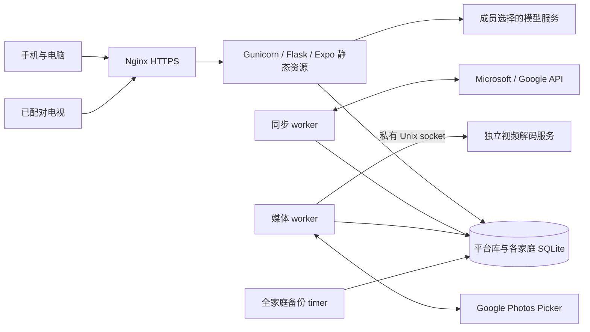

# 家庭中枢 · Family Dashboard

面向伴侣共同管理的家庭看板：手机和电脑负责安排与维护，两块电视按各自侧重成员展示日程、公共资金和已授权影像。个人财务、私人资料与家庭共享分别授权。

**当前已发布：通用账单可选收支方向列。** 本批于 2026-09-21 00:26:30（北京时间）激活，00:27:04只读回读通过；非作者生产审计已通过。地点搜索、重复照片提示、设备照片及视频轮播继续可用。保持 **73 张户内表、9 张平台表、五个服务**。

[日常管理](https://home.caesarcharles.world/) · [电视配对](https://home.caesarcharles.world/tv) · [私有 GitHub 仓库](https://github.com/caesarvan/family-dashboard) · [最新发布证据](docs/FINANCE-FLOW-ACCEPTANCE.md#finance-flow-release)

相册原照片详情可主动「查找重复照片」，结果仅说明「展示副本一致，原图未核验」；助理地点结果可打开原地图／旅行／照片再返回查询。本人实际操作与实体电视仍待验收，此前discovery批次的分段验证与生产边界见[对应验收](docs/DISCOVERY-ACCEPTANCE.md#discovery-release)。

通用账单可在「收支方向（可选）」选择原文件方向列，重新预览后「确认导入 · 仅本人」。若保存结果不明，点击「核对保存结果」；不要重新发起同一导入。同文件不双记，方向冲突不覆盖已保存交易；[使用与验收](docs/FINANCE-FLOW-ACCEPTANCE.md#finance-flow-release)。

## 从这里开始

| 你要做什么 | 最短入口 |
|---|---|
| 使用家庭看板 | [成员使用手册](docs/USER-GUIDE.md)；日程、待办、采购、旅行从主导航进入 |
| 导入设备照片 | 相册 → 选择照片 → 设备照片 → 上传并生成预览 → 明确私密保存 |
| 看往年同日照片 | 相册 → 那年今日；只读取本人有可靠来源日期的往年静态照片 |
| 查重复展示副本 | 相册 → 本人已保存照片详情 → 查找重复照片；分页打开原照片，可返回提示 |
| 找回原地点 | 家庭助理 → 搜索：地点名称 → 整理并预览 → 在地图查看；返回保留查询和页码 |
| 分享照片或视频 | 原详情明确家庭共享；电视另按每台设备授权，二者不互相代替 |
| 绑定日历和清单 | 设置中的账户与自动同步；注册和权限说明见 [Microsoft / Google 接入](docs/ACCOUNT-SYNC.md) |
| 新 agent 接手 | 本 README → [HANDOFF](docs/HANDOFF.md) → 模块契约 → [开发指南](docs/DEVELOPMENT.md) |
| 更新已有服务器 | 先核 [当前发布合同](docs/FINANCE-FLOW-RELEASE.md)，再读部署与恢复文档；不要重放历史计划 |

原 README 的 515 行发布历史和全部链接保存在 [2026-09-20 历史快照](docs/README-HISTORY-20260920.md)。历史段落中的“当前”不再作为现行架构或部署依据。

## 已实现的产品范围

下表描述已发布实现。模拟服务商、本地浏览器、服务器核验与真实账号／设备验收的覆盖不能互换。

| 模块 | 已实现 | 主要边界 |
|---|---|---|
| 首页与外观 | 今日安排、家庭资金、任务入口；成员主题、密度、卡片排序与隐藏 | 电视布局独立；隐藏卡片不改变 API 权限 |
| 日程 | 今日、本周、前后3天、翻页、完整标题／地点、范围内时间重叠提示 | 云同步按已选来源轮询；重叠组不等于两人工作量冲突 |
| 日程隐私 | 新本地安排默认私密，可明确共享和撤回；原 ID／版本编辑 | 同步日程沿来源权限，在原应用调整；不是 iCloud 实时连接 |
| 待办与提醒 | 本地及云任务、前置依赖、完成门禁、例行计划；本人已读／稍后提醒 | 站内提醒不会替用户完成任务；新云发布写入仍需真实账号验收 |
| 采购与库存 | 数量、负责人、截止、优先级、预算、实付和参考图；批次、收货、消耗、售后关联待办 | 私人订单来源不公开；不自动购物、付款、扣减公共余额 |
| 旅行 | 可编辑计划、准备清单、采购／日程联动、当地时区分段、改期、JSON 导入、路线与回顾 | 保存前核对并确认；预订状态手工维护，不连接航司／酒店下单 |
| 地图与资料 | 地点管理、到访、授权坐标及助理查询→地图／旅行／照片往返；私有资料与明确共享 | 返回保留原查询页；地图不做街道导航或自动地理编码，资料不自动下载、验票或查毒 |
| 相册 | Google Picker 明确选片；设备照片上传；净化加密、私密确认、原详情、共享和逐台电视授权；本人主动查询跨来源重复展示副本 | 不核验原图，不自动合并／删除；真实 Google 视频、手机选择器与实体电视另验 |
| 视频 | Google 来源视频导入流程、独立解码、成员播放及电视照片／视频混合播放 | 本地视频上传尚未实现；视频缓存限额与硬件播放兼容仍有边界 |
| 那年今日 | 本人往年同日静态照片、年份分组、分页、原详情编辑返回、跨午夜回到首页 | 日期未知单独统计；本地上传首版日期均未知，不虚构回忆 |
| 公共财务 | 荷包手工快照、预算、旅行准备金、储蓄、出资比例及批准的资产／负债汇总 | 小荷包和银行未自动连接，不执行转账、理财或交易 |
| 个人财务 | 账单／订单预览确认、分类预算、来源基线、消费观察、持仓、资产账户及历史估值分析 | 仅本人；各来源不重复加总，缺失估值不当零；无银行／券商自动连接 |
| 家庭助理 | 本地概览、已有旅行／资料／照片／库存搜索；旅行草案与改期、预算和支出查询 | 写入前预览确认；可选模型与本地规则分开，不自动向云端发布 |
| 成员与家庭 | 成员登录、邀请、移除／退出、登录设备撤销、明确家庭切换、第三方身份绑定 | 现行容量和成员限制见平台契约；没有公开商业化运营承诺 |
| 个人导出 | 本人数据 ZIP、JSON／CSV，明确选择附带共享记录，带散列清单 | 媒体与资料导出为允许的元数据；不含他人私密、令牌或原文件 BLOB，无一键导入 |

设备照片首批支持 **1～10 张 JPEG / PNG / WebP，每张最多 8 MiB、2000 万像素**。上传仅产生暂存，必须明确确认后才保存；未知结果先核对原批次，不能自动另建操作。HEIC／HEIF、动画、多帧和本地视频不在此入口范围。

本地照片不从文件修改时间或无时区 EXIF 推测拍摄日期。用户可先从 iCloud／NAS 导出再选择文件，但这不代表已交付 iCloud／NAS 连接或实时同步。

详细流程见 [设备导入](docs/LOCAL-PHOTO-IMPORT.md)、[前端恢复](docs/EXPO-LOCAL-PHOTO-IMPORT.md)、[视频验收](docs/MEDIA-VIDEO-ACCEPTANCE.md#media-video-release)、[回忆界面](docs/EXPO-PHOTO-MEMORIES.md)。

## 软件架构

新版前端采用 **React Native + Expo Router + React Native Web + React Native Paper**，按 [Expo 风格约定](docs/EXPO-SITE-STYLE.md)组织页面；设计原则见 [DESIGN.md](DESIGN.md)。生产交付 Expo 静态导出，由 Flask 同源托管，没有独立 Node 运行服务。`/classic` 保留兼容界面，`/tv` 为独立只读展示入口。

| 服务 | 职责与现行限额 |
|---|---|
| `app` | Flask API、身份权限与同源页面；Gunicorn 1 worker / 4 threads，内部8000端口，384 MiB |
| `sync` | 日历、清单、发布队列及站内提醒等调度；与 app 同应用镜像，192 MiB |
| `media` | Google 选片任务、下载和净化；与 app 同应用镜像，384 MiB |
| `decoder` | 无网络的独立视频解码服务，经私有 Unix socket 通信，768 MiB、禁 swap |
| `web` | Nginx 对外80／443、TLS与代理，96 MiB；精确 raw 上传路径关闭请求缓冲 |

运行配置见 [compose.yaml](compose.yaml)、[应用 Dockerfile](Dockerfile)、[解码镜像](deploy/Dockerfile.media-video-service)和 [Nginx 配置](deploy/nginx.conf)。这些限额不构成任意并发下的资源保证。

后端使用 Python 3.12 生产镜像、Flask、Gunicorn、SQLite WAL与事务；依赖固定在 [requirements.txt](requirements.txt)。前端版本与安装锁定在 [package.json](frontend/package.json)及 [package-lock.json](frontend/package-lock.json)。

平台库记录家庭及成员关系，各家庭使用独立 SQLite。命名数据卷挂载到 `/data`；应用源码位于 `/opt/family-dashboard`，发布原件位于独立候选／release 目录。第三方令牌、媒体及私人内容不会进入前端配置。

同步使用轮询、持久队列、条件回写与失败退避；“已入队”不等于远端已保存。同步状态页是数据库观测，不证明服务商全部内容、实时进程状态或财务自动同步。

## 代码与接口导航

| 范围 | 权威代码入口 | 契约与使用说明 |
|---|---|---|
| 前端路由／状态 | [frontend/src/app](frontend/src/app)、[screens](frontend/src/screens)、[lib](frontend/src/lib) | [前端 README](frontend/README.md)、[Expo 接缝](docs/EXPO-NAVIGATION.md) |
| 基础 API／日程 | [app.py](app.py)、[calendar_privacy.py](calendar_privacy.py) | [API](docs/API.md)、[日程隐私](docs/CALENDAR-PRIVACY-ACCEPTANCE.md) |
| 身份／多家庭 | [member_sessions.py](member_sessions.py)、[household_spaces.py](household_spaces.py)、[household_memberships.py](household_memberships.py) | [会话](docs/MEMBER-SESSIONS.md)、[平台](docs/PLATFORM.md) |
| 云账户／同步 | [cloud_accounts.py](cloud_accounts.py)、[cloud_providers.py](cloud_providers.py)、[sync_worker.py](sync_worker.py) | [账户接入](docs/ACCOUNT-SYNC.md)、[同步状态](docs/SYNC-HEALTH.md) |
| 云日历／待办发布 | [calendar_publish.py](calendar_publish.py)、[task_publish.py](task_publish.py) | [日历发布](docs/CALENDAR-PUBLISH.md)、[待办发布](docs/TASK-PUBLISH.md) |
| 依赖／提醒／例行 | [task_dependencies.py](task_dependencies.py)、[task_reminders.py](task_reminders.py)、[household_routines.py](household_routines.py) | [任务依赖](docs/TASK-DEPENDENCIES.md)、[提醒](docs/TASK-REMINDERS.md)、[例行计划](docs/ROUTINES.md) |
| 旅行／地点／资料 | [journey_workflows.py](journey_workflows.py)、[journey_places.py](journey_places.py)、[journey_routes.py](journey_routes.py)、[journey_documents.py](journey_documents.py) | [旅行字段](docs/TRAVEL-DETAILS-PLAN.md)、[路线](docs/JOURNEY-ROUTES-ACCEPTANCE.md)、[资料](docs/JOURNEY-DOCUMENTS.md) |
| 相册／设备上传 | [household_media.py](household_media.py)、[media_local_upload.py](media_local_upload.py)、[media_images.py](media_images.py) | [设备导入](docs/LOCAL-PHOTO-IMPORT.md)、[回忆查询](docs/MEDIA-MEMORIES.md) |
| 视频／电视媒体 | [media_import_worker.py](media_import_worker.py)、[media_video_service.py](media_video_service.py)、[media_playback.py](media_playback.py) | [视频交付](docs/MEDIA-VIDEO-ACCEPTANCE.md)、[电视布局](docs/TV-DISPLAY.md) |
| 采购／库存 | [shopping_settlement.py](shopping_settlement.py)、[inventory_core.py](inventory_core.py)、[inventory_sources.py](inventory_sources.py) | [实付核对](docs/SHOPPING-SETTLEMENT.md)、[物品交付](docs/INVENTORY-DELIVERY.md) |
| 财务／来源／投资 | [finance_hub.py](finance_hub.py)、[finance_baseline.py](finance_baseline.py)、[finance_accounts.py](finance_accounts.py)、[investment_import.py](investment_import.py) | [财务 API](docs/FINANCE-API.md)、[来源桥接](docs/FINANCE-SOURCE-BRIDGE.md)、[投资导入](docs/INVESTMENT-IMPORT.md) |
| 助理 | [home_assistant.py](home_assistant.py)、[assistant_trip_intent.py](assistant_trip_intent.py) | [平台 API](docs/PLATFORM-API.md)、[资料照片搜索](docs/ASSISTANT-DOCUMENT-SEARCH-UI.md) |
| 本人导出 | [data_portability.py](data_portability.py) | [导出格式与权限](docs/PORTABILITY.md) |
| 打包／发布 | [deploy](deploy) | [当前五服务发布合同](docs/LOCAL-PHOTO-RELEASE.md)、[完整验收索引](docs/VALIDATION.md) |

常用接口从 `/api/me`、`/api/state`、`/api/items/*`、`/api/accounts/*`、`/api/media/*`、`/api/assistant/*` 和 `/api/portability/*` 进入。精确方法／路径参见 [路由索引](docs/PLATFORM-ROUTES.md)，字段、错误码和可见范围以各模块契约与源码为准。

所有写入沿当前家庭／成员身份、CSRF、revision和幂等回执执行。保存冲突保留草稿；结果未知先按原 ID／请求编号核对。UI 中显示的标题、负责人或当前页对象不能代替服务端权限和最新原行。

## 隐私与数据规则

| 数据 | 可见范围 |
|---|---|
| 个人账户、收入基础、消费、私人账本和投资明细 | 仅本人；不返回伴侣或电视 |
| 批准的资产／负债汇总与覆盖说明 | 按明确批准范围共享；不附带账户明细 |
| 公共资金、家庭任务和采购等共享内容 | 当前家庭成员；电视仅获准的只读投影 |
| 新本地日程、旅行资料、相册内容 | 各自默认私有／按模块明确共享；共享可撤回 |
| 电视照片／视频 | 除家庭共享外，还必须逐台设备授权；撤销和会话失效重新核验 |
| 其它家庭、第三方令牌和登录凭据 | 不跨家庭返回，不进入导出、日志或 Git |

共同消费走公共资金，个人消费走个人账户。税后收入出资50%、荷包周转目标 ¥10,000、日常 ¥6,200/月、旅行 ¥104,000/年都是可编辑的规划参考，不是实付或已核对余额。

现有财务基线有版本、覆盖与日期边界。消费观察不与账本叠加，手动账户不与持仓重复合计；未知数值保持未知。真实财务输入、数据库、账户名、密钥和运行截图不得提交源码仓库。

## 本地开发与检查

1. 按 [AGENTS.md](AGENTS.md)和 [Git 协作](docs/GIT-WORKFLOW.md)确认任务分支、worktree、base与文件所有权。
2. 使用独立 Python 环境与锁定依赖；前端安装、类型检查和 Expo Web 导出采用 [前端 README](frontend/README.md)现有步骤。
3. 准备虚构成员、独立开发密钥、临时 `DATA_DIR`，按 [开发指南](docs/DEVELOPMENT.md)启动本地服务。Python 不自动读取 `.env`。
4. 完整登录／保存验收由 Flask 同源托管导出，以验证 Cookie、CSRF和CSP；Expo 开发服务器不能替代同源验收。
5. 只运行修改所需的后端、Node／TypeScript与浏览器检查，保留失败及修订证据；不要为了统计数字重复全量测试。
6. 浏览器工具使用临时 Flask／SQLite、虚构 fixture和本机 Edge；`browser_*_check.py` 不是默认 pytest 自动执行项。

测试入口和环境细节集中在 [DEVELOPMENT](docs/DEVELOPMENT.md)、[frontend/README.md](frontend/README.md)和对应功能的 browser／验收文档。本页不追加另一套启动或部署命令。

原件写入被 Git 忽略的 `test-results/`，记录固定输入、命令终态、实际节点／截图和输出 SHA；源代码、导出与镜像必须能相互绑定。模拟云测试、临时浏览器和实际账号结果分开报告。

不要将旧 `live_check.py` 等可能写正式环境的脚本当默认回归。生产也不运行 Expo 开发服务器，不用未经核对的 `dist` 覆盖线上。

## 部署、备份与故障恢复

当前服务器为 racknerd VPS／Ubuntu，Name.com 管理域名 DNS，Nginx 负责 HTTPS。现有生产使用 app、sync、media、decoder、web 五服务；本批地点入口与重复提示更新没有 DDL，保持73/9。

**现行更新合同是 [DISCOVERY-RELEASE](docs/DISCOVERY-RELEASE.md)。** 本批计划已消费，下次必须绑定实际父版并生成新计划。[DEPLOYMENT](docs/DEPLOYMENT.md)和 [OPERATIONS](docs/OPERATIONS.md)中的旧表数、旧镜像及迁移命令保留历史含义，不能覆盖本页和最新验收所绑定的父版。

| 环节 | 必须保留的核验 |
|---|---|
| 新安装 | 独立配置、密钥、数据卷、域名／TLS、五服务与权限；不复制生产数据或旧已消费计划 |
| 候选准备 | 实际父源码／manifest／五服务身份；固定候选包、Expo输入、镜像、测试、资源及非作者审查 |
| 计划准入 | 生成全新固定计划，独立核对后显式执行 stage；stage通过不等于部署完成 |
| 激活 | 持发布锁、暂停备份并停全部写者；核验完整库组备份，安装源与镜像 |
| 保全 | 仅启动 app 初始化全部登记家庭，再停止；严格比较完整表、settings、序列与对象，不能豁免媒体或提醒 |
| 开放与回读 | 保全通过后恢复五服务和备份timer；正常TLS、权限、源码／运行字节、镜像及配置只读复核 |
| 失败 | 保留失败attempt和现场，禁止重放；按原发布回执决定完整组恢复，不自动重启旧版 |

app／sync／media使用同一应用镜像；最近一批保留原 decoder镜像及四个运行文件。应用发布包含112个非Expo文件与23个静态导出；精确运行身份见集中验收，不以文档提交 SHA 替代。

备份须覆盖平台注册库与所有已登记家庭，保留散列清单和配套密钥。在线备份不等同跨库原子快照；恢复必须保持完整家庭映射，按 [会话恢复合同](docs/MEMBER-SESSIONS.md#恢复后使旧成员登录失效)处理旧登录。

73→73隔离两户三库的正常、注入漂移与完整恢复已验证；生产最近一批没有恢复数据库。发布只读回读也不代表重新校验活库内容、备份SQLite字节或worker业务tick。

不要删除数据卷、覆盖密钥、仅回退镜像或只恢复一个家庭。已有业务写入时先保全现场，再确定恢复策略；旧71表、四服务或首次迁移入口不能操作当前73/9五服务环境。

## 多 agent 的交付流程

私有仓库 `caesarvan/family-dashboard` 已建立。`main` 存放已审稳定源码，`codex/integration` 是组合候选；仓库私有不等于已经配置强制分支保护或完整CI/CD。

1. 集成人给每个任务固定base、独立 `codex/<agent>-<task>` 分支与worktree、允许文件和接口合同。
2. agent仅修改自己的工作目录；共享文件先协调负责人，不能让多个agent同时编辑同一物理目录。
3. 作者提交小范围变更，交付head、diff、实际检查、失败历史和未验范围。
4. 非作者按固定base/head独立审查；修订用新提交和定向复验，旧原件不覆盖。
5. 集成人按依赖合入integration，完成同源码组合检查后再经PR合main。
6. 生产准入与部署另行执行；不以push／merge替代，不通过服务器 `git pull` 发布。

协作协议、任务模板和冲突处理见 [GIT-WORKFLOW](docs/GIT-WORKFLOW.md)、[HANDOFF](docs/HANDOFF.md)。不要提交 `.env`、数据库、真实财务、凭据、截图或 `test-results/`；文档更新也不能改写旧测试结果。

## 已发布证据与剩余工作

| 证据入口 | 能确认什么 |
|---|---|
| [地点入口与重复提示](docs/DISCOVERY-ACCEPTANCE.md#discovery-release) | 当前 source `63dc634`、manifest `7b77dfb`、app镜像 `b63c1f5`；保留125与新增9项Linux、5＋1分段浏览器、四请求资源及生产回读 |
| [设备照片与那年今日](docs/LOCAL-PHOTO-ACCEPTANCE.md#local-photo-release) | 父版 `79e5ef9`；191实际Linux、浏览器分段、R3媒体资源、73→73演练和当批生产只读审计 |
| [视频与混合播放](docs/MEDIA-VIDEO-ACCEPTANCE.md#media-video-release) | 五服务来源、独立解码与73/9迁移、实际资源和完整恢复演练边界 |
| [本地日程隐私](docs/CALENDAR-PRIVACY-ACCEPTANCE.md#calendar-privacy-release) | 私密默认、共享／撤权、身份与导出边界 |
| [日程重叠](docs/CALENDAR-CONFLICTS-ACCEPTANCE.md#calendar-conflicts-release) | 多日范围、原安排编辑、分轮浏览器及生产保全 |
| [任务依赖](docs/TASK-DEPENDENCIES-ACCEPTANCE.md#task-dependencies-release)与[本人提醒](docs/TASK-REMINDERS-ACCEPTANCE.md#task-reminders-release) | 完成门禁、私人已读／稍后状态与发布证据 |
| [资料与照片搜索](docs/ASSISTANT-DOCUMENT-SEARCH-ACCEPTANCE.md#assistant-document-search-release) | 早期授权元数据搜索与原详情往返；地点新入口的后续证据见本批验收 |
| [VALIDATION](docs/VALIDATION.md)与[历史README](docs/README-HISTORY-20260920.md) | 更早模块、分轮成功／失败和固定原件索引，按对应版本解释 |

最近一批生产实际为一户两库：73/9全组保持、1188安装文件、三个应用服务各135运行文件与decoder原4文件核对通过，五服务正常，app／decoder健康，备份timer active。完整SHA和原件集中在最新验收页；本批合入main `1d589e6` 时仅比安装source多四份后验文档，不能替换包内source身份。

失败也属于交付记录：设备照片浏览器曾因会话预期和无界等待失败；图像资源R1 OOM、R2触限及首次构建权限失败均保留。R3通过不抹去此前失败，也不扩成任意负载保证。

待继续处理的范围：

- **本人验收：** A–D完整本人场景仍为0/4；真实Google视频、云日历／待办新写入、实际手机选择器和两块实体电视分别验收。
- **影像来源：** iCloud／NAS实时连接、本地视频上传、更多格式和原图备份没有随设备照片入口交付。
- **财务与连接：** 小荷包／银行／券商自动连接、真实来源映射持续刷新及Apple提醒事项桥接仍待接入。
- **可靠性：** 异地备份、生产恢复验证、更多家庭容量、混合峰值和完整CI/CD仍需独立任务，不能由当前合成实验推断完成。

完整产品目标与后续计划见 [PRODUCT-PLAN](docs/PRODUCT-PLAN.md)，真实场景见 [集中验收场景](docs/ACCEPTANCE-SCENARIOS.md)。新任务从集成人核对的当前源码与实际线上身份开始。
