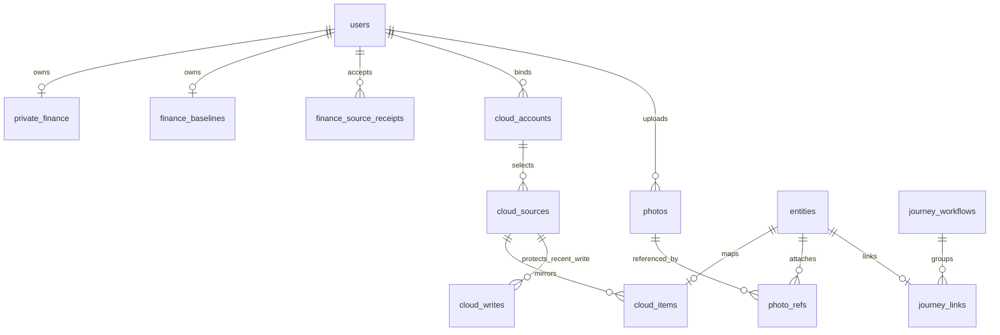

# 数据模型、同步一致性与隐私边界

**当前版本：2026-09-15 16:25:03（北京时间），镜像 `sha256:f1e4cc56979f793f32585f498fa2fca55987356bd68f67e8cc6c14f0b1b6a01d`。** 旅行执行进度、真实待同步提示及两个订单表头兼容已发布，保留此前全部模块；源码与文档数量见 [README](../README.md) 及逐文件交接清单；101 个方法／路径模板、42 张户内表及 2 张平台表。本轮无结构迁移。真实云写与其他外部验收仍按 [VALIDATION](VALIDATION.md) 单列。

当前结构为 **42 张户内表（40 业务 + 2 认证）和 2 张平台表**，16:25 运行版本保留全部表及原值，没有结构迁移。两张本人消费观察表于 2026-09-15 15:10 的历史 40→42 迁移新增，当时严格保留原表及序号。完整 DDL、观察与回执字段见 [SPENDING-OBSERVATIONS](SPENDING-OBSERVATIONS.md)。没有全局 schema 版本号或自动旧数据重建；历史例行三表仍保持原契约。

> 本文汇总基础表及旅行 v2、持久云队列、财务来源回执的模型。多家庭与备份见 [平台扩展](PLATFORM.md)，完整表名与字段见 [当前存储索引](PLATFORM-ROUTES.md)。2026-09-15 01:10 历史版本每户 28 张业务表；02:33:28（北京时间）已部署版本新增 finance_source_receipts 后为 29 张，并增加旅行时间 JSON 与日历 review_required 列。平台目录仍为 2 张表。“单个数据库”仅指一户数据边界；当前部署及运行读回见 [交接说明](HANDOFF.md)。

本文于 2026-09-15 按当前本地代码补充；基础校验由 `app.py`、`cloud_accounts.py`、`shopping_media.py`、`finance_baseline.py` 执行，扩展见 `journey_workflows.py`、`journey_time.py`、`calendar_publish.py`、`task_publish.py`、`finance_source_bridge.py`。数据库 JSON 本身没有 JSON Schema 或 SQL CHECK 约束。请求示例见 [API](API.md) 和 [平台 API](PLATFORM-API.md)，开发入口见 [DEVELOPMENT](DEVELOPMENT.md)，运维与备份见 [OPERATIONS](OPERATIONS.md)。本文只列结构和虚构字段，不包含真实账户、财务余额或凭证。

成员会话已于 2026-09-15 07:58:24 发布，新增 `member_sessions`、`member_session_browsers` 及 `cloud_oauth_states.auth_context`；总计 31 张户内表（29 业务+2 认证）与 2 张平台表。认证凭据散列、浏览器代次及 `settings.member_sessions_legacy_v1` 只进完整管理员备份，不进入个人业务导出。恢复及保留期见 [会话契约](MEMBER-SESSIONS.md)。

**投资增量已于 2026-09-15 08:56:01 发布：** [投资持仓整理表导入](INVESTMENT-IMPORT.md) 追加下述四张投资表，复用已有 `hub_investments`；该 08:56 版本为 35 张户内表（33 业务 + 2 认证）与 2 张平台表。上方 31 表属于 07:58 历史版本；本次不把历史持仓自动迁移为已关联来源，实际表清单及保留核对见 [验收记录](VALIDATION.md)。

**12:11:36 采购历史版本为 37 张户内表（35 业务 + 2 认证）及 2 张平台表。** 当时新增 `hub_shopping_settlements` 与 `hub_shopping_settlement_receipts`，只存本人采购关联和回执；共享实体仅接收明确确认的 actual/done，不保存私人来源。其字段与本人导出规则见 [采购核对契约](SHOPPING-SETTLEMENT.md)，当前完整结构见页首；例行三表保留下节说明。

## 1. 存储与初始化

### 旅行资料候选的第 43 张表

当前 Git 集成源码新增 `journey_documents`；页首 42 表是线上基线，候选尚未部署。候选每户 **43 表（41 业务 + 2 认证）**，平台注册库仍为两表。完整列和 SQL 见 [资料契约](JOURNEY-DOCUMENTS.md) 与 [源码存储索引](PLATFORM-ROUTES.md)。

- `owner` 外键指向本户 `users`。`journey_id` 指向 `journey_workflows`，使用 `ON DELETE SET NULL`；分段键仅作逻辑关联，不是 SQL 外键。
- 文件保存在 SQLite BLOB 中；`bytes` 与内容长度一致。新上传必须关联存在的旅行，管理时可解除关联；可见范围默认 private，只有本人明确选择才 shared。没有有效旅行关联时，对外始终按 private 处理。
- `(owner, request_id)` 唯一，内容与原请求元数据摘要用于幂等。同一请求即使资料已改名、移动或旅行被删除，仍返回现有资料；不同请求内容冲突，删除后的旧请求不会复活文件。
- 删除旅行时，若 revision 未由该操作主动修改，解除关联触发器递增 revision 并更新时间；文件与上传者保留。存储的 visibility 可能仍为 shared，但有效范围变为 private。删除分段不改文件或 revision，列表派生 `segmentMissing` 提醒重新关联。删除资料则清除文件及展示字段，以 tombstone 保留去重信息；日历、共享实体和助理没有资料副本。
- 两个显式部分索引支持本人资料及旅行共享检索。首次 42→43 迁移要求新表为空、全部约束／索引／触发器匹配冻结 DDL，原 42 表及平台注册库的结构、行和内部序号完整保留，见 [迁移检查器](JOURNEY-DOCUMENTS.md#一次性-4243-迁移检查器)。

管理员的完整 SQLite 备份含文件 BLOB 和删除记录，需按完整备份保护和恢复；个人 ZIP 只导出元数据，不能用来恢复文件。恢复较早备份可能带回后来删除的文件或后来撤回的共享状态，撤销旧登录会话并不会删除这些业务内容，恢复前后均需核对。候选恢复夹具已加入虚构资料的权限与原字节核对，实际 Docker 结果另见 [恢复演练](RECOVERY-REHEARSAL.md)。以下基础初始化说明继续适用。

`app.py` 先建立并提交核心表，再构造 `MemberSessions`；后者用 URI `mode=rw` 打开已有库。子家庭缓存命中前也检查库存在，无 Cookie 返回入口不加载旧户库。这些保证只覆盖本次会话连接与家庭入口，不意味着其他 SQLite 连接均禁止建库。

单个 SQLite 文件：`DATA_DIR/household.sqlite3`。生产为 `/data/household.sqlite3`，存放在 Docker 命名数据卷中，Web app 与同步 worker 共用。数据库启用 WAL；应用连接启用 `PRAGMA foreign_keys=ON`，连接等待超时 15 秒。

早期基础 schema 为 15 张业务表；当前完整数量与版本分界见页首，不含 SQLite 自建的 sqlite_sequence。没有 Alembic 或 schema_migrations 表，也没有全局 schema 版本号。`app.py` 初始化核心表后，由各模块注册器创建附加表；源码表清单不等同已部署表清单。

显式兼容迁移包括 devices 的 calendar_view/revision、任务发布的 target_key/previous_status，以及 02:33 版本日历发布的 review_required；通过 PRAGMA table_info 检查后补列。旧采购 JSON 不需要逐行迁移；读取/编辑时将缺失的 budget、actual、photoIds 分别按未知、未知、空列表处理。旅行 v1 不隐式改成 v2；由本人预览确认升级并保留已有实体 ID。

02:33 历史发布先停止旧 app/sync，再串行初始化现有 1 户数据库。后续 2026-09-15 03:11:08 版本已加入日历发布表的并发初始化事务：`BEGIN IMMEDIATE` 覆盖 PRAGMA 列检查、review_required 补列和命名空间写入，异常回滚；真实双进程回归验证旧库竞争与已有标志保留。表数仍为 29，平台注册表仍为 2；这不是对整个应用初始化作单一事务保证。部署继续保留停写、备份和串行预热；真实云写边界见 [日历发布](CALENDAR-PUBLISH.md)。

## 2. 关系概览



`settings`、`devices`、`attempts`、`audit` 和 `cloud_oauth_states` 未在图中展开。实体 JSON 内的 `owner` / `tripId`、设备 `focus` 等是应用层关系，不是数据库外键。不要因字段名为 `owner` 就假定它必然控制隐私。

## 3. 核心表

| 表 | 列及约束 | 语义 |
| --- | --- | --- |
| `users` | `id TEXT PK`，`username TEXT UNIQUE NOT NULL`，`name TEXT NOT NULL`，`password TEXT NOT NULL`，`auth_version INTEGER NOT NULL DEFAULT 1` | 固定 `member1` / `member2`；password 为 Werkzeug 密码哈希；修改密码提升 auth_version 使旧会话失效 |
| `entities` | `id TEXT PK`，`kind TEXT NOT NULL`，`data TEXT NOT NULL`，`revision INTEGER NOT NULL DEFAULT 1`，`updated_at TEXT NOT NULL`；索引 `entities_kind(kind)` | 四类共享记录：tasks/shopping/events/trips；`data` 为 JSON |
| `settings` | `id TEXT PK`，`data TEXT NOT NULL`，`revision INTEGER NOT NULL DEFAULT 1` | `finance` 为家庭财务快照，`meta` 的 revision 列为共享状态版本 |
| `private_finance` | `owner TEXT PK REFERENCES users(id)`，`data TEXT NOT NULL`，`revision INTEGER NOT NULL DEFAULT 1` | 每位成员一份当前月度财务快照，不是按月累计的交易明细表 |
| `devices` | `id TEXT PK`，`code TEXT UNIQUE`，`secret_hash TEXT NOT NULL`，`name TEXT NOT NULL DEFAULT ''`，`focus TEXT`，`approved INTEGER NOT NULL DEFAULT 0`，`expires REAL NOT NULL`，`created_at TEXT NOT NULL`，`calendar_view TEXT NOT NULL DEFAULT 'today'`，`revision INTEGER NOT NULL DEFAULT 1` | 未批准配对与已授权电视；code 可清空；focus 为侧重成员；视图 today/week/around |
| `attempts` | `ip TEXT NOT NULL`，`category TEXT NOT NULL`，`stamp REAL NOT NULL` | 登录、配对、照片等按 IP 和操作分类限速；访问限速器时清理早于一小时的记录 |
| `audit` | `id INTEGER PK AUTOINCREMENT`，`actor TEXT`，`action TEXT NOT NULL`，`target TEXT`，`stamp TEXT NOT NULL` | 部分本地写操作的动作/目标记录，不保存完整前后数据，也不是涵盖所有同步/导入的审计账本 |

核心 `audit()` 会同时增加 `settings.id='meta'` 的 revision。`settings.data` 内早期保存的 `revision` 键不是当前并发控制依据；接口使用 SQL 的 revision 列覆盖它。

## 4. 共享实体 JSON

API 在 `data` 外增加实体 `id` 和 `revision`。下列字段描述手动创建时的规范化数据；同步适配器可保留更长的原始标题、地点和备注，不能直接把云镜像强行压回手动表单上限。

| kind | `data` 字段 | 规则 |
| --- | --- | --- |
| `tasks` | `title`，`done`，`owner`，`note`，`due`，`tripId` | title 最长 100，note 最长 500；due 为 `YYYY-MM-DD` 或空；tripId 为已存在的 trips ID 或空 |
| `shopping` | `title`，`done`，`owner`，`note`，`quantity`，`budget`，`actual`，`photoIds` | quantity 为最长 30 字符的说明；budget/actual 为非负整数分或 null；photoIds 不重复且最多 3 个 |
| `events` | `title`，`owner`，`location`，`note`，`start`，`end`，`allDay`，`source`，`imported`；旅行 v2 增加 `travelTiming/startDate/endDateExclusive` | location 最长 200，普通日程 note 最长 8000；手动时间归一到北京时间；v2 时间及关联由工作流保护，见下文 |
| `trips` | `title`，`destination`，`start`，`end`，`budget`，`saved`，`paid`，`note` | 起止为日期，返程不早于出发；三个金额均为整数分；destination 最长 80，note 最长 2000 |

手动金额校验不接受浮点、字符串或 bool。采购 `null` 表示没有记录；`0` 表示明确的零金额。整项预算不是单价，不与 quantity 自动相乘。采购完成状态与实际金额分别保存；勾选不会自动扣减荷包、增加旅行已付或写入个人支出。

`owner` 允许 `member1`、`member2`、`shared`，用于责任和展示归属。所有这些实体都进入 `/api/state`，对两位成员和已配对电视可见。个人消费不应新增成 `entities.owner='member1'` 的记录来实现“私有”；那仍是共享实体。

旅行准备关系包含 `data.tripId → entities(kind='trips')` 与 data.journeyId；创建/编辑时验证旅行存在，实际工作流关联由 journey_links 维护。删除旅行时清空关联任务、采购和日程的 tripId/journeyId/workflowKey 并递增 revision，保留记录历史和已发布远端事项。SQLite 无法对 JSON 内关系执行外键级联。

全天事件的结束边界不计入下一天。日程工作量按北京时间与每天求交集，对侧重成员和共同安排的计时事件合并重叠时段；全天计数不折算为 24 小时。日历视图只统计看板已有事件，不能推断未选择日历的工作量。

云端实体附带：

```json
{
  "sync": {
    "provider": "microsoft",
    "sourceId": "local-source-id",
    "remoteId": "remote-item-id",
    "version": "opaque-provider-version",
    "readOnly": false
  }
}
```

日历镜像 `readOnly=true`；云任务可完成/恢复，编辑 API 只接受 `revision` 和 `done`。标题/备注修改和删除目前在原应用操作。`sourceId` 是创建云任务的路由参数；实际来源关系由 `cloud_items` 和 `sync` 维护，不是普通可任意改写的业务字段。

### 旅行工作流与 v2 时间元数据（02:33 版本）

| 表 | 关键列 / 约束 |
| --- | --- |
| `journey_workflows` | id PK；trip_id UNIQUE FK entities ON DELETE CASCADE；plan JSON、revision、created_by FK users、created_at/updated_at |
| `journey_links` | journey_id FK workflows ON DELETE CASCADE、item_key、entity_id UNIQUE FK entities ON DELETE CASCADE、kind；PK(journey_id,item_key) |
| `journey_actions` | actor FK users、action_key、operation_id UNIQUE、digest、result JSON、created_at；PK(actor,action_key) |

plan 不带 schemaVersion 时按 v1 日期级分段处理。v2 显式 schemaVersion=2、referenceTimezone 和目的地 timeZone；段为 flight/stay/activity/legacy_day，保留稳定 key、bookingState、datePolicy。两端时间点保存 local、IANA timeZone、offsetMinutes 与确认的 UTC instant；入住/退房为日期，checkout 排他，nights 按日期差计算。字段和能力响应见 [旅行 v2](TRAVEL-DETAILS-PLAN.md)；校验/投影由 [journey_time.py](../journey_time.py) 执行。

referenceTimezone 只用于旅行范围核对和详情参考展示。全站 calendar-ui.js 的分天/忙碌计算仍固定 Asia/Shanghai，不把这个 plan 字段当作全站时区设置。

| 事件字段 | 含义 |
| --- | --- |
| `start/end` | 定时段为 UTC Z；全天段使用 `+08:00` 零点兼容显示，不声称是酒店真实入住时刻 |
| `startDate/endDateExclusive` | 仅日期型旅行事件；包含开始、不含结束，住宿结束直接等于退房日 |
| `travelTiming.schemaVersion/kind/segmentKey` | 版本 2、行程类型和稳定分段标识 |
| `travelTiming.bookingState/datePolicy` | idea/booked/cancelled 与 fixed/shift_with_trip；人工状态不等于平台核验预订 |
| `travelTiming.startLocal/endLocal/startTimeZone/endTimeZone/startOffsetMinutes/endOffsetMinutes` | 定时段的原两端当地时间与 IANA/偏移 |
| `travelTiming.departure/arrival/flightNumber` | 航班保留规范化两端点、机场/城市和可选航班号 |
| `travelTiming.startDate/endDateExclusive/timeZone/nights/propertyName/address/checkInTime/checkOutTime` | 按类型存在的日期、酒店与已知入住/退房信息；未知钟点为空，精确的可选酒店 instant 保留在 plan |

普通实体 POST 禁止客户端伪造旅行时间元数据；有 journey_links 的受管事件 PATCH 保留时间/日期/关联，修改这些值返回 409，标题/地点/备注仍可独立编辑。解绑的日程在下次普通编辑时移除过时的受管时间元数据。所有此类实体仍为家庭共享，时区或负责人不会赋予私密性。

工作流预览从旧 plan 投影基线，与当前实体和新 plan 三方比较；独立编辑保留，双边同组变更需 current/plan 明确选择。timing 为整体组，计划时间变化时 note 也随该组确认。生效合并结果签入预览，apply 校验工作流及所有实体 revision 后在一个写事务中保存；不用新计划覆盖已选择保留的当前值。stable segment key 继续对应同 entity ID，取消/恢复或重排不生成副本；真正移除段采用解绑而非实体/远端删除。详情含 plan 和实际 events，两者在明确保留冲突时可以不同。

已确认 UTC instant 留在 plan 中，materialize 基线时不按新的时区规则重新推导。新预览发现 instant 与 IANA 规则矛盾会报错要求核对。ICS 全天用 VALUE=DATE，定时用 UTC Z，沿用稳定 UID 与 revision SEQUENCE。

## 5. 家庭和个人月度财务

`settings.id='finance'` 的 JSON 字段如下，金额单位均为整数分：

| 字段 | 含义 |
| --- | --- |
| `wallet`、`reserveTarget`、`upcomingPayments` | 已核对荷包余额、目标备用金、近期待付款 |
| `livingSpent`、`livingBudget` | 本月日常已花与预算 |
| `travelSaved`、`travelAnnualBudget` | 旅行储备与年度旅行预算 |
| `longterm` | 共同长期储蓄 |
| `contributionPercent` | 收入转入公共账户的百分比，整数 0–100 |
| `confirmedAt`、`note` | 最近人工核对时间和备注 |

首次初始化的默认预算是产品起始设置，不表示已经读取金融账户。`confirmedAt` 为空时 UI 要显示待核对。PUT 更新后服务器设置核对时间；这个 settings 快照本身不是交易流水。[财务账本](FINANCE-API.md) 的 hub_transactions 独立维护，不依据来源基线自动计算荷包余额。

`private_finance.data` 为 `{income, spent, budget, month, confirmedAt}`。接口只按当前登录成员 ID 查找和更新，不能通过请求中的 owner 切换成员；电视无权读取。记录不存在时 GET 返回零值占位、当前月份及 `revision:0`，这与资产基线未知值的 `null` 语义不同。存储每人只有一行，更新月份会替换旧月快照；历史消费摘要来自另一份基线 payload，不应误称此表有月度历史。

## 6. 云账号与同步表

| 表 | 列及约束 | 语义 |
| --- | --- | --- |
| `cloud_accounts` | `id TEXT PK`，`owner TEXT NOT NULL REFERENCES users(id)`，`provider`，`client_id`，`subject`，`name`，`email`，`tokens` 均 TEXT NOT NULL；`needs_reauth INTEGER NOT NULL DEFAULT 0`；UNIQUE(provider,client_id,subject) | 第三方身份绑定一个成员；稳定 subject 识别身份，不凭邮箱自动关联 |
| `cloud_sources` | `id TEXT PK`，`account_id TEXT NOT NULL REFERENCES cloud_accounts(id) ON DELETE CASCADE`，`remote_id`、`kind`、`name`、`owner` 均 TEXT NOT NULL；`is_primary INTEGER DEFAULT 0`，`last_success TEXT DEFAULT ''`，`next_attempt REAL DEFAULT 0`，`error TEXT DEFAULT ''`，`failures INTEGER DEFAULT 0`，均 NOT NULL；UNIQUE(account_id,kind,remote_id) | 已选择日历或清单；kind 为 calendar/tasks；owner 为显示归属，任务固定 shared |
| `cloud_items` | `entity_id TEXT PK REFERENCES entities(id) ON DELETE CASCADE`，`source_id TEXT NOT NULL REFERENCES cloud_sources(id) ON DELETE CASCADE`，`remote_id TEXT NOT NULL`；UNIQUE(source_id,remote_id) | 本地共享镜像与远端 ID 映射 |
| `cloud_writes` | `source_id TEXT NOT NULL REFERENCES cloud_sources(id) ON DELETE CASCADE`，`remote_id TEXT NOT NULL`，`record TEXT NOT NULL`，`expires REAL NOT NULL`；PK(source_id,remote_id) | 已被服务商确认的近期写结果，临时覆盖落后的读取快照；不是离线任务队列 |
| `cloud_oauth_states` | `state_hash TEXT PK`，`browser_hash`、`provider`、`mode`、`verifier`、`client_id` 均 TEXT NOT NULL；`owner TEXT`，`auth_version INTEGER`，`expires REAL NOT NULL` | 十分钟一次性 OAuth 上下文；绑定浏览器、平台、模式和成员会话版本 |

`cloud_one_primary` 是 `cloud_sources(is_primary) WHERE is_primary=1` 的唯一索引，约束全家庭至多一个主清单。2026-09-15 01:10 发布版本允许 Microsoft 或 Google Tasks 经账户拥有者明确选择后作为家庭主清单。其他成员不能通过选择自己的来源抢走另一账号已存在的主清单。此授权不表示 Google 原生清单获得了共享能力。

本地镜像 ID 为 `cloud-` 加上 `SHA256(source_id + '|' + remote_id)` 的前 32 个十六进制字符。它保证同一来源的同一项目重复同步映射稳定；跨来源重复选择同一真实事件不等于自动全局去重。

轮询流程：

1. worker 每轮调用 `tick()`，挑选已到 `next_attempt` 的来源，按账号取得非阻塞进程锁。
2. 必要时刷新令牌；完整获取并校验服务商分页，日期范围为过去 30 天至未来 365 天。
3. `publish()` 在 `BEGIN IMMEDIATE` 事务内保存所有新/更新记录、删除远端快照已不存在的镜像、更新来源状态，最后增加共享 revision。
4. 来源快照失败时保留旧实体，更新经过清理的错误提示与退避时间；不会发布半页或把失败当成空日历。

一次来源快照最多 2500 项、家庭云镜像最多 20000 项。每位成员最多绑定 4 个账号；每账号最多选择 12 个来源，家庭最多 24 个。正常任务/日历检查间隔分别约 30/60 秒；失败退避上限 900 秒。前端还有约 10 秒刷新延迟，这不是毫秒级推送。

按账号的 OS 文件锁放在 `DATA_DIR/cloud-locks/`，Linux 用 flock、Windows 用 msvcrt。Web 回写、令牌刷新、轮询、取消来源和解绑采用同一锁边界；进程结束由 OS 释放，不靠可被慢请求抢占的过期租约。

远端任务写成功后，保存镜像并插入有效期约 120 秒的 `cloud_writes`。服务商读取已追上该结果时删除保护项；短暂旧快照不会立即把已勾选任务恢复。保护期不是永久重试机制，无法保证所有远端写请求具备任意网络失败下的 exactly-once 语义。

取消来源时先删除对应镜像 entities，再删除来源；解绑账号清理全部所选来源及镜像。外键从 cloud_items 指向 entities，直接删除 source 只会级联删除映射，并不会反向删除 entities；维护工具必须复用正确的清理顺序。

### 持久发布队列与旅行复核门槛

cloud_writes 是短期回流保护，与 calendar_publications/task_publications 持久队列不同。后两者从明确选择的本地实体发布，保留原实体的负责人和旅行关联，避免改成重复云镜像；完整字段以 [日历发布](CALENDAR-PUBLISH.md) 和 [待办发布](TASK-PUBLISH.md) 为准。

| 队列表 | 关键字段与保护 |
| --- | --- |
| `calendar_publications` | id 为家庭 namespace/provider/client/subject/日历/entity 派生的稳定键；owner FK users；journey_id/entity_id/source_id/account_id/provider/calendar_id；remote_id/etag/last_hash/local_revision；pending_data/pending_hash/pending_revision；status/error/attempts/next_attempt/created_at/updated_at |
| `calendar_publications.review_required` | 02:33 版本新增 INTEGER NOT NULL DEFAULT 0；时间类型/时区/取消语义变化设为 1 且 status=needs_review，保留全部 pending 与远端恢复证据 |
| `task_publications` | entity_id UNIQUE，owner/account_owner 区分确认成员和账号拥有者；target_key/previous_status 保留同目标重连与停止状态；baseline_data/pending_data/pending_revision、remote_id/etag、attempted 记录远端基线及可能已发出的创建，不允许重连后清零 attempted 盲目重发 |

日历 review_required 独立于 status：成员可 pause，但 flag 仍为 1，resume/retry/普通 confirm/worker 都不能清除它；只有签名 review-preview/review-confirm 完成后才置为 0 并保存新 pending。对旧 remote_id 的 404 进入冲突，不自动创建替代事件。远端恢复与本地新语义确认是不同步骤，不能仅凭本地 plan 已保存宣称云端同步完成。

同稳定身份/日历重选后可明确预览确认迁移 source/account 引用；旧/新账号按稳定顺序锁定，事务内校验拥有者和 targetDigest，保留暂停、冲突、review flag 和远端信息。迟到的后台任务、错误或操作在锁内比较账户/队列绑定快照，不能持旧账号锁更改新绑定。不同云目标可有另一次明确发布，但不能暗中重用原队列；另一成员不能接管原成员的发布。已发布远端与已断开来源有意不设级联删除，不把本地移除当作远端删除。

## 7. 图片表和共享时点

| 表 | 列及约束 | 语义 |
| --- | --- | --- |
| `photos` | `id TEXT PK`，`content BLOB NOT NULL`，`size INTEGER NOT NULL`，`width INTEGER NOT NULL`，`height INTEGER NOT NULL`，`created_by TEXT NOT NULL REFERENCES users(id)`，`created_at REAL NOT NULL` | 清洗后的 JPEG 字节；随机 32 位十六进制 ID；size 为实际保存字节数 |
| `photo_refs` | `photo_id TEXT NOT NULL REFERENCES photos(id) ON DELETE CASCADE`，`entity_id TEXT NOT NULL REFERENCES entities(id) ON DELETE CASCADE`，PK(photo_id,entity_id)；索引 `photo_refs_entity(entity_id)` | 采购和图片的关系，和实体写入一起提交 |

图片先以草稿上传，只有上传者可读取；至少关联一个共享采购实体后，两成员及已配对电视均可读取。删除最后一个引用后立即收回共享读取权限，但原上传者仍可读取。未引用且超过 24 小时的图片，在下一次上传时清理；不是定时任务，也没有独立删除 API。

`sync_photo_refs()` 先验证所有新 photoIds 的存在和可用性，再替换引用；验证失败连同实体写入一起回滚。已有家庭共享图片可以被其他成员继续引用；别人的未保存草稿不能被猜 ID 后关联。`photo_refs` 外键只约束实体存在，实体 kind=shopping 和最多 3 张属于应用约束。

服务端接受 JPEG/PNG/WebP 的 data URL，原始解码字节最多 5 MB、400 万像素，最长边压至 1600，最终 JPEG 最多 2 MB。统一新建 RGB 画布输出，去除 EXIF/GPS 等元数据；单进程限制同时一次解码。全库最多 500 张且累计 200 MB；上传在写锁中核算配额。图片跟随 SQLite 在线备份，不能只备份 JSON 表。

## 8. 财务基线表与 payload

`finance_baselines` 每个成员最多一行：

| 列 | 类型与含义 |
| --- | --- |
| `owner` | TEXT PK REFERENCES users(id)，私有明细归属成员 |
| `private_data` | TEXT NOT NULL，私有 JSON 来源快照 |
| `shared_data` | TEXT NOT NULL，经过白名单处理的共享 JSON |
| `source_digest` | TEXT NOT NULL，来源版本的 64 位 SHA-256 十六进制摘要 |
| `content_hash` | TEXT NOT NULL，规范化有效内容的 SHA-256，用于幂等 |
| `revision` | INTEGER NOT NULL DEFAULT 1，本成员基线版本 |
| `updated_at` | TEXT NOT NULL，数据库本次更新的 UTC ISO 时间 |

旧兼容 CLI 接收顶层恰为 `{private,shared}` 的 JSON，两个 payload 的以下字段必须相同：`schemaVersion:1`、`owner`、`currency:'CNY'`、`sourceDigest`、`asOf`、`balanceAsOfStart`、`balanceAsOfEnd`、`importedAt`。完整输入上限 2 MB。所有 `*Cents` 金额校验为整数分，可按字段允许 null 或有符号；不接受把浮点金额直接写入。02:33 版本的普通来源更新应走下述候选预览/CAS 确认，不用旧 CLI 绕过确认。

日期有不同含义：

- `asOf`：这版来源/导入基线的截至日期，不是所有余额同时测得的时间。
- `balanceAsOfStart` / `balanceAsOfEnd`：记录余额的日期范围，必须起始不晚于结束、结束不晚于 asOf。
- `importedAt`：含时区的导入时间；不同于记录日期。
- 每条明细的 `asOf`：该项来源日期。来源转换必须据实填写；导入器验证日期合法性，但不会替代人工检查所有证据日期和来源覆盖。

私有 payload 必须包含 `assets`、`liabilities`、`income` 三个数组，每类最多 500 条。明细至少为：

| 字段 | 规则 |
| --- | --- |
| `label`、`category`、`status`、`source` | 非空字符串，最长 2000 字符；用于账户名称、分类、证据状态和来源定位 |
| `amountCents` | 非负整数分或 null；缺少余额/估值保持 null |
| `currency` | 三位大写币种码，私有记录可保留外币 |
| `asOf` | 合法日期 |
| `includedInRecordedSubtotal` | 资产和负债必须提供布尔值；收入不计入资产/负债小计 |

可额外包含 `note`、`period`、私有 `sources`、`monthlyBudgetCents` 和 `spending.monthly` 历史摘要。前端读取的历史消费条目包括 `period`、`transactionCount`、`netSpendCents`、`currency`；这是来源识别摘要，不是应用中的完整交易流水。

`private.totals` 与 shared 的全部金额/完整度字段必须类型和值一致：

| 字段 | 完整或部分覆盖的含义 |
| --- | --- |
| `complete` | 明确的布尔值；不能根据数组非空推断完整 |
| `recordedAssetCents`、`recordedLiabilityCents` | 已记录人民币小计，必须逐项加总核对 |
| `assetCents`、`liabilityCents`、`netCents` | partial 时必须为 null；complete 时完整总额应与 recorded 小计一致，且 net=asset-liability |

当前已导入版本为部分覆盖，前端显示“已记录资产 / 已记录负债”和记录日期范围，暂不显示完整净资产。现有前端条目固定提示待完整核对；如果未来导入 complete=true，先补齐对应展示分支和测试。

以下不能未经核实计入共享人民币小计：

- 缺少当前估值的房产、投资，或尚未核对的账户余额。
- 只看到自己账户转出、没有确认收款方余额的转账；不能同时把转出前余额和预计转入算成两笔资产。
- 没有确认账单余额的信用卡项目；授信额度不是可用资产或实际负债。
- 尚未归属的股票/补偿、合同收入或预测收入；不能当作本月到账工资或公共账户余额。
- 没有已核实汇率依据的外币余额；保留币种记录，不假定按 1:1 汇入人民币。

导入器对被标记为 included 的记录要求 CNY、已知金额、逐项总和匹配；它不会自动判断全部经济含义。来源转换负责人仍必须决定证据状态和排除口径。`excluded` 白名单包含 `missingValuations`、`unconfirmedTransfers`、`foreignCurrencyConversion`、`unvestedCompensation`、`unconfirmedCreditBalances` 五个布尔标记。

共享序列化只允许身份/版本日期、币种、上述 totals、`coverage`、`coverageNote` 和受限 excluded。`coverage` 与说明由服务器生成固定文案，避免来源文本泄漏私有账户名称。该白名单在导入时和 `/api/state` 输出时分别应用。共享状态的 `wealth` 为按成员保存的基线数组；只导入一位成员，不表示已经包含两人全部财产。个人明细由 `/api/finance-baseline/private` 按当前成员 ID 返回；没有该成员基线时返回 JSON null，电视返回 403。

幂等指纹对 private/shared 内容规范化排序后计算，只排除顶层 `importedAt`。同一有效内容重复导入不修改 revision；只改变导入时间也不形成新版本。`sourceDigest` 相同而内容有变会被视为更新；摘要不是“可以信任所有内容”的认证凭证。CLI 只替换指定成员的基线并增加 meta revision，不改荷包、个人月度财务、采购或其他实体。

### 财务来源持久回执（02:33 版本）

默认完整财产基线分支的输入、稳定映射和日期／覆盖规则见 [FINANCE-SOURCE-BRIDGE](FINANCE-SOURCE-BRIDGE.md)。下表是 02:33 历史新增并继续使用的 finance_source_receipts，确认成员只读／导出自己的回执。显式 spending_observation 使用独立 finance_spending_observations／finance_spending_receipts 两表，不写原财产基线，见 [独立消费观察](SPENDING-OBSERVATIONS.md)。

| `finance_source_receipts` 列 | 类型 / 含义 |
| --- | --- |
| `id` | TEXT PRIMARY KEY；已确认预览的幂等回执标识 |
| `owner` | TEXT NOT NULL REFERENCES users(id) |
| `candidate_digest` / `source_digest` | TEXT NOT NULL；规范候选及来源版本摘要 |
| `expected_revision` | INTEGER NOT NULL；预览绑定的旧基线版本 |
| `expected_source_digest` | TEXT，可空；首次基线使用 null |
| `baseline_revision` | INTEGER NOT NULL；本次确认结果的基线版本 |
| `status` | TEXT NOT NULL；imported 或 unchanged |
| `accepted_at` | TEXT NOT NULL；实际确认时刻，独立于财务来源日期 |

索引 `finance_source_receipts_owner(owner,accepted_at)`。默认完整基线确认在 BEGIN IMMEDIATE 内校验候选签名／目标版本、稳定映射和日期，原子写入基线、此回执与审计；失败回滚。同一成功预览只重放历史结果。spending_observation 分支另校验观察与原基线的双版本，只写独立观察和其回执，原基线整行保持。两个分支均不保存原预览令牌、签名或源文件原文。

默认完整财产基线的来源 manifest／转换器与候选摘要保存在 `finance_baselines.private_data.sourceBridge`；独立消费观察的对应摘要保存在它自己的规范化快照与回执，互不替代。候选不接受客户端指定 owner/shared/totals/importedAt；服务端按本人身份重算已批准共享的人民币资产/负债小计，complete=false、完整资产/负债/净资产保持 null。来源月度消费属于私有观察，含自己的区间/质量标记，不写 hub_transactions、hub_investments、private_finance 或公共荷包，也不与它们相加。备份包含回执和私有基线；恢复及个人数据导出必须继续按 owner 限制。

## 9. 事务与 revision 的约定

<a id="投资持仓导入四表独立候选尚未部署"></a>

### 投资持仓导入四表

[investment_import.py](../investment_import.py) 由 `register_finance_hub()` 在原投资表初始化后登记。四表均按当前家庭数据库保存，`owner TEXT NOT NULL REFERENCES users(id)`；不增加平台级投资目录。现有 `hub_investments` 的 id、owner、JSON data、revision、updated_at 继续保存实际持仓，文件新增／实际更新使用 `valuationSource:file_import` 和 `visibility:private`。

| 表 | 关键列与约束 | 保存及导出边界 |
| --- | --- | --- |
| `hub_investment_sources` | PK(owner,source_name)；revision INTEGER 默认 1，updated_at TEXT | 本人稳定来源名称及版本；不是银行账号或授权身份 |
| `hub_investment_links` | PK(owner,source_name,holding_key)；UNIQUE(owner,investment_id)；created_at TEXT；(owner,source_name) FK sources | investment_id 不设删除级联；持仓删除后保留关联墓碑，防止原键自动重建 |
| `hub_investment_import_previews` | id TEXT PK；context_hash、source_name、source_digest、snapshot TEXT；expires_at REAL、created_at TEXT；索引(owner,expires_at) | 15 分钟规范化快照／回放引用及会话摘要，不保存原文件；每人最多 20 份有效暂存，后续预览清理过期行；完全禁止个人导出 |
| `hub_investment_import_receipts` | id TEXT PK；source_name、source_digest、result、confirmed_at TEXT；UNIQUE(owner,source_name,source_digest) | 已确认的历史业务结果；每人最多 20,000 份回执，不是投资当前值或交易流水 |

来源最多 300 个／人，实际持仓仍受每人 300 项上限限制；文件最多 300 项，任何错误阻止整批确认。来源名与 holdingKey 组合只在本人范围内稳定，`recordId` 只能明确关联本人可用记录，不能改绑另一来源或成员。文件缺行不删除持仓，旧日期、改币种或已知估值变空会拒绝。

预览在写事务中保存本人持仓（id/data/revision）、全部来源及关联的摘要。确认在 `BEGIN IMMEDIATE` 内比较该摘要，再一起写实际持仓、来源／关联、回执和审计；不一致返回 409，失败回滚。同一成功文件的回执优先用于只读回放，不按历史快照覆盖当前持仓。同一手工持仓仅建立关联且字段不变时，原 data/revision 不变。

完整管理员备份包含这四表，个人 ZIP 则只导出本人 sources、links 和 receipts 的固定业务列。回执 result 仅允许 `created/updated/unchanged/replayed/receiptId/confirmedAt` 标量；暂存 snapshot、context_hash、token、nonce 以及会话凭据不导出。投资数据不进入共享汇总或电视；具体导出字段见 [PORTABILITY](PORTABILITY.md#投资导入历史)。本次发布没有把持仓与公共荷包、消费流水或历史财务基线相加，输入和接口详见 [INVESTMENT-IMPORT](INVESTMENT-IMPORT.md)。

### 既有事务边界

| 写入 | 并发控制与原子范围 |
| --- | --- |
| 本地实体 PATCH/DELETE | 客户端提交已读 revision；SQL 条件更新/删除并检查影响行数；过期返回 409 |
| 采购写入 | 实体 JSON、photo_refs、审计和 meta revision 同事务；拒绝图片时整体不提交 |
| 家庭/个人财务 | revision 条件更新；个人首次创建必须提交 revision=0 |
| 电视显示设置 | revision 条件更新 name/focus/calendar_view，增加设备及 meta revision |
| 云端发布 | 完整来源快照在 BEGIN IMMEDIATE 中发布，包含增改删和状态更新；失败回滚 |
| 云任务回写 | 账号锁下先检查当前实体 revision 和服务商版本，远端成功后保存镜像与短期写保护 |
| 财务基线导入 | SAVEPOINT 包住单成员 upsert 与 meta revision；异常回滚到保存点，调用方 commit |
| 财务来源候选确认 | BEGIN IMMEDIATE 内检查 expected revision/sourceDigest、日期和稳定映射，再调用基线 upsert 并写回执/审计；重复预览回执重放 |
| 旅行预览确认 | 校验工作流/关联实体 revision；生成基线三方合并已签名；旅行、清单、事件和链接一个事务；语义复核前先取得发布账号锁 |
| 云日历时间复核/重连 | 同一账号锁内检查 queueBinding；重连先按顺序取得旧/新账户锁；写事务保留或明确更新 pending/remote/version/flag，不让旧连接覆盖新状态 |

`settings.meta.revision` 是前端发现共享变化的信号，不是所有表的逐行版本，也不是 schema 版本。限速记录、OAuth state 和某些仅更新时间的维护操作不会要求重绘整个界面。新增写入口必须明确它是否改变共享可见数据，以及应增加哪层 revision。

## 10. 加密、认证与角色边界

第三方 `cloud_accounts.tokens` 和 `cloud_oauth_states.verifier` 使用 Fernet 加密，密钥由 `SECRET_KEY` 加上固定用途字符串派生。state 和浏览器标识存 SHA-256；电视保存 secret 的 SHA-256。用户密码使用 Werkzeug 的单向哈希。成员 session 是 Flask 签名 cookie，包含成员 ID、auth_version、CSRF 等会话信息，不存放第三方令牌。

普通实体、个人月度财务、财务基线、照片以及候选旅行资料 BLOB 在 SQLite 中不是字段级加密；第三方账户姓名和邮箱也不加密。权限隔离发生在应用 API，服务器管理员及持有数据库/密钥的人仍具维护读取能力。备份包含同样敏感数据；这不是端到端加密系统。

| 数据 | 本人 | 伴侣 | 已配对电视 | 匿名 |
| --- | --- | --- | --- | --- |
| 所有共享实体、公共财务 | 读写，云镜像受对应限制 | 同左 | 只读 | 不可读 |
| 批准共享的资产/负债汇总 | 读 | 读 | 读 | 不可读 |
| 个人月度财务、资产/收入/消费明细 | 仅本人读取；月度表可本人修改 | 只能读其自己的记录 | 不可读 | 不可读 |
| 第三方账号详情/来源配置 | 仅绑定拥有者管理 | 不能管理对方账号 | 不可读 | 不可读 |
| 已选共同云清单中的任务 | 家庭成员可通过看板新建/完成/恢复 | 同左，即使不是绑定拥有者 | 只读 | 不可读 |
| 未附加照片 | 上传者读 | 非上传者不可读 | 不可读 | 不可读 |
| 已附加采购照片 | 读 | 读 | 读 | 不可读 |
| 旅行资料（候选） | 上传者读写 | 只读仍关联有效旅行的明确共享资料 | 不可读 | 不可读 |

绑定拥有者的管理边界与家庭共同清单的协作写权限有意不同。共享状态可包含所选来源的名称、任务来源 ID、provider、同步时间和已清理错误；不包含第三方账号邮箱或凭证。

更换 `SECRET_KEY` 会使成员会话失效，并使已有加密第三方令牌不可解读。不要在普通发布时生成新 key，也不要只恢复数据库却遗漏匹配的私有配置。写接口仍必须经成员认证、同源 JSON 与 CSRF 校验；新增 GET 私有接口要显式调用 `require_member()` 并以 `g.actor.id` 限定 owner。

## 11. 下一次 schema 变更注意事项

1. 先在旧 schema 的临时副本上验证迁移，再测空库初始化和重复启动。当前 app 与 worker 都可能初始化数据库；新迁移需考虑并发启动，不能只检查一次列存在就假定复杂迁移天然安全。
2. 优先追加可兼容字段，给旧 JSON 定义默认值。表重建或字段含义变化应引入可审查的 schema 版本和一次性迁移流程，不在请求路径隐式清空旧数据。
3. 每个直接 SQLite 连接启用 foreign_keys；确认外键的方向和级联对象。新增关系同时写失败回滚、父项删除、重复引用和旧数据兼容测试。
4. 备份使用 SQLite 在线备份 API，覆盖主库、图片、基线和旅行资料 BLOB；不要在运行中只复制 `.sqlite3` 而忽略 WAL。任何恢复或迁移演练都先使用独立目录/卷，不能把测试脚本指向生产库。
5. 回滚旧镜像前检查 schema 和数据向后兼容；镜像回退不等于自动回退数据。保护用户已有密码、账号绑定和财务快照。
6. 财务基线当前只接受 payload schemaVersion=1。新增版本要同步转换器、校验器、白名单、前端、API 文档和隐私回归；不要放宽为任意 JSON 直接进入共享响应。

## 12. 家庭例行计划三表与共享边界

| 表 | 关键字段与约束 |
|---|---|
| household_routines | id 主键；kind=tasks/shopping；template/schedule 为白名单规范 JSON；state=active/paused/archived；revision、current_index；created_by 引用本户 users；created_at/updated_at |
| routine_occurrences | (plan_id,occurrence_index) 联合主键、index>0；plan_id 引用规则；entity_id 唯一但不设 entities 外键，保留删除历史；scheduled_on、state=current/completed/skipped、created_at/closed_at |
| routine_receipts | id 主键、owner 引用本户用户、nonce_digest、operation、plan_id、result、created_at；UNIQUE(owner,nonce_digest) |

显式索引 household_routines_state(state,id)；部分唯一索引 routine_occurrences_current(plan_id) WHERE state='current'。SQL 中存在相应 CHECK、主键及隐式唯一索引；精确 DDL 以冻结 `household_routines.py` 为准。模板只允许 title/owner/note，shopping 再有 quantity/budget；不接受 private finance、cloud/source、photoIds、trip 或付款关联字段。自由文字仍要求成员不要写入私人凭据。

current_index 是生成次数，不是锚点间隔序号。当前期的 pending/completed/missing 状态可由实体推导，闭合后 history 保存 completed/skipped，后来重开旧实体不回退规则。手改 due 不改变 scheduled_on；所有新期使用模板且从原 anchor 找严格晚于 max(当前 scheduled_on,today) 的日期。

创建预览不写库；确认在同一事务写规则／新实体／期次／回执／审计和 meta。周期 tick 同事务推进一期，无计划或不应推进时无业务写入。新实体仍是原 state 可见的共享 tasks/shopping；管理 context 不返回 TV。新表升级初始为空，不自动填入当前家务、历史事项或未来云任务。

管理员备份含完整三表。显式 includeShared 的业务导出仅允许 [ROUTINES](ROUTINES.md) 中的 plans/occurrences/receipts 白名单；不导出确认者 owner、nonce_digest、完整 result、签名／会话上下文。采购实付与其他私人财务关系不进入共享计划。历史例行迁移精确校验旧 37 表及三新表，其后的 40→40 指导仅属于当时版本。2026-09-15 15:10 的历史消费观察迁移为 40→42，16:25 历史无结构更新使用 42→42；旅行资料候选须独立执行页首 42→43 检查，不得复用零结构流程。详见 [DEPLOYMENT](DEPLOYMENT.md)。
